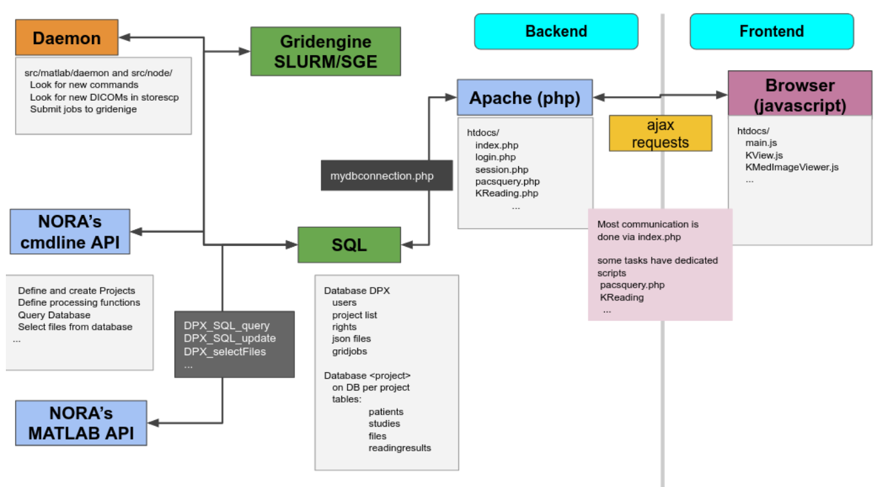
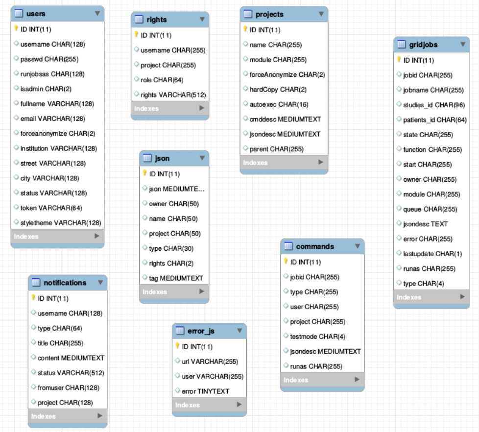
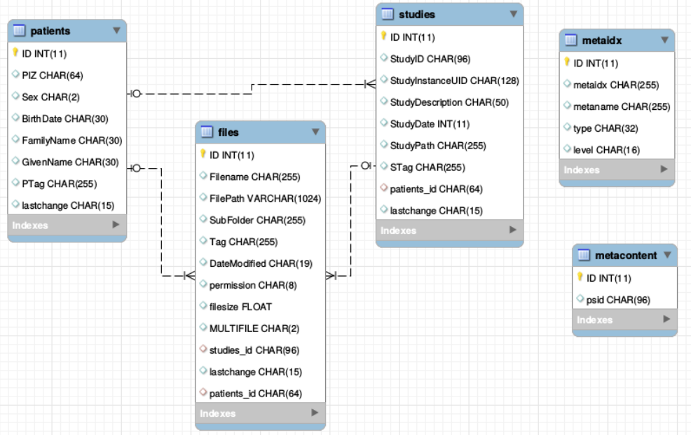

# Administration Backend



#### Command line Interface (BASH)

<span style="font-weight: 400;">You need a PATH to </span>`<span style="font-weight: 400;"><path-to-nora>/src/node</span>`

<span style="font-weight: 400;">Call</span>

`<span style="font-weight: 400;">nora</span>`

<span style="font-weight: 400;">any get help</span>

```
                                                                                                                                                                                            
 NORA - backend                                                                                                                                                                              
usage: nora [--parameter] [value]                                                                                                                                                            
--project (-p) [name]                                                                                                                                                                        
       all preceding commands refer to this project                                                                                                                                          
                                                                                                                                                                                             
MANAGEMENT                                                                                                                                                                                   
--sql (-q) [sqlstatement]  [--csv]                                                                                                                                                           
       executes SQL statment and return result as json (or as csv if option is given)                                                                                                        
--add (-a) [file] ...                                                                                                                                                                        
       adds list of files to project                                                                                                                                                         
       option: --addtag tag1,tag2,... (tags the files)                                                                                                                                       
--del (-d) [file] ...                                                                                                                                                                        
       deletes list files                                                                                                                                                                    
--del_pat (-dp) [patient_id] [patients_id#studies_id] ...                                                                                                                                    
       deletes list of patients/studies                                                                                                                                                      
--out (-o) [filepattern]                                                                                                                                                                     
            computes absolute outputfilepath from filepattern (see description of filepattern below)                                                                                         
--pathout (-pa) [filepattern]                                                                                                                                                                
            computes absolute outfilepath from filepattern                                                                                                                                   
--select (-s) [--json (-j)] [--byfilename] [filepattern]                                                                                                                                     
            returns files matching filepattern, if --json is given, files are return as json filepattern                                                                                     
            if --byfilename (together with --json) is given, files are restructered by filename                                                                                              
--addtag tag1,tag2,... -s [filepattern]                                                                                                                                                      
            add tag to file                                                                                                                                                                  
--rmtag tag1,tag2,... -s [filepattern]                                                                                                                                                       
            removes tags fromfile                                                                                                                                                            
--launch (-l) [json]                                                                                                                                                                         
            launches batch from json description                                                                                                                                             
--createproject (-c) [name] [module]  
            creates a project with [name] from [module] definition
--admin [parameter1] [parameter2] ... 
            calls the admin tools (see nora --admin for more help)

PROCESSING
--launch json      
            launches a NORA job given by json 
            options: --throwerror
                     --handle_job_result (emits DONE signal, when ready) 
--launchfile jsonfile      
            same as --launch but json given by fileref 
--launch_autoexec psid 
       launches the autoexecution pipeline of the project for the patient specified by psid
--import srcpath      
            imports dicoms located in sourcepath to given project 
            options: --autoexec_queue (if given autoexecuter is initiated, use DEFAULT to select default autoexecution queue given in config) 
                     --handle_job_result (emits DONE signal, when ready) 
                     --extrafiles_filter: if there are non-dicom files in your dicomfolder and you 
                    want to add them to your patient folder, then, give here a comma-separated list of 
                    accepted extensions (e.g. nii,hdr,img)
                     --patients_id PIZ (overwrite patients_id of imported data with PIZ ) 
                     --studies_id SID (overwrite studies_id of imported data with SID ) 
                     --pattern REGEX (use REGEX applied on srcpath of dicoms to overwrite 
                                patients_id/studies_id, example: 
                          --pattern "(?<studies_id>[\w\-]+)\/(?<patients_id>\w+)$" 

OTHER
--exportmeta [filepattern]      
            exports meta data as csv. Meta content from files matching [filepattern] are exported
            options: --keys a comma separated list of key-sequences, which are exported [optional]
                   a key sequence is given by a dot-separated list, where the first key refers to the name of 
                   the json-file (as multiple jsons might be contained in the query). A wildcard * is possible 
                   select multiple keys at once 
                     examples: 
                   nora -p XYZ --exportmeta '*' 'nodeinfo.json'       // gathers also patient info
                   nora -p XYZ --exportmeta '*' 'META/radio*.json' --keys '*.mask.volume,*.mask.diameter'


```

#### MATLAB Interface

<span style="font-weight: 400;">To setup NORA for MATLAB you change to the folder </span>

<span style="font-weight: 400;">`<path-to-nora>/src/matlab`  
  
</span><span style="font-weight: 400;">at the MATLAB prompt and start </span><span style="font-weight: 400;">DPX\_startup. </span><span style="font-weight: 400;">This sets up all necessary paths and the database connection. To test the DB connection, make a call to </span><span style="font-weight: 400;">DPX\_Project</span><span style="font-weight: 400;">. This should list all created projects (initially only the default project). There are a variety of management commands to manage users/project/data etc. Here a list of important ones:</span>

- <span style="font-weight: 400;">General</span>
- <span style="font-weight: 400;">DPX\_startup</span><span style="font-weight: 400;"> - sets up NORA</span>
- <span style="font-weight: 400;">DPX\_Project</span><span style="font-weight: 400;"> - choose a project</span>
- <span style="font-weight: 400;">DPX\_getCurrentProject</span><span style="font-weight: 400;"> - get the current project information</span>
- <span style="font-weight: 400;">DPX\_SQL\_createUser</span><span style="font-weight: 400;"> - create a user</span>
- <span style="font-weight: 400;">DPX\_SQL\_createProject</span><span style="font-weight: 400;"> - create a project</span>

- <span style="font-weight: 400;">File selection </span>
- <span style="font-weight: 400;">DPX\_getOutputLocation </span><span style="font-weight: 400;">- compute the path to certain output</span>
- <span style="font-weight: 400;">DPX\_selectFiles </span><span style="font-weight: 400;">- select files based on pattern</span>
- <span style="font-weight: 400;">DPX\_getFileinfo </span><span style="font-weight: 400;">- get additional file information (no database involved)</span>
- <span style="font-weight: 400;">DPX\_SQL\_getFileInfo</span><span style="font-weight: 400;"> - get information from database for this file</span>

- <span style="font-weight: 400;">Processing</span>
- <span style="font-weight: 400;">DPX\_demon -</span><span style="font-weight: 400;"> start the processing deamon</span>
- <span style="font-weight: 400;">DPX\_debug\_job -</span><span style="font-weight: 400;"> execute a debug job at the MATLAB command prompt</span>


<span style="font-weight: 400;">DPX\_SQL\_clearGridCmds -</span><span style="font-weight: 400;"> clear all jobs from the pipeline</span> <span style="font-weight: 400;"> </span>

#### The Database

<span style="font-weight: 400;">There is one general database scheme containing information about users, projects, jobs, settings etc.   
</span><span style="font-weight: 400;">You can see below the table schemes. </span>

- **Projects/User management**

- <span style="font-weight: 400;">projects</span>
- <span style="font-weight: 400;">users</span>
- <span style="font-weight: 400;">rights - who can read which project in which role</span>


- **Batch/Jobs**

- <span style="font-weight: 400;">gridjobs - contains submitted and running jobs (mirror of qstat or squeue)</span>
- <span style="font-weight: 400;">Commands - contains jobs submitted from web interface, but not yet submitted to resource management system.</span>


- **Miscellaneous**

- <span style="font-weight: 400;">json - various types of jsons (saved batches, shares, settings, states etc.)</span>
- <span style="font-weight: 400;">notifications</span>
- <span style="font-weight: 400;">error\_js</span>





