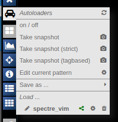
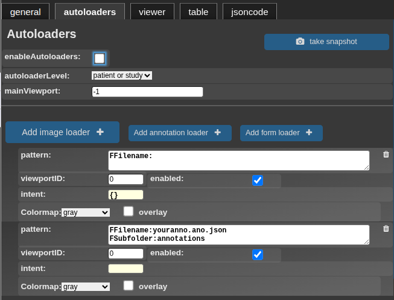
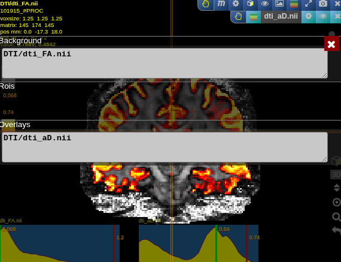

# Autoloaders

Autoloaders are NORA's way of opening the right files for a case automatically. Instead of manually dragging the same background images, overlays, ROIs, forms, or annotations into the viewer every time, you define a loading pattern once and reuse it across many patients or studies.

This is especially useful for quality control, structured reading, standardized review layouts, and any workflow where the same kinds of files should always appear in the same viewports.

## Where to find them

The autoloader menu is available from the left toolbar.

This menu is the quick access point for the whole feature. It lets you switch autoloaders on and off, create new autoloaders from the current viewer state, edit the currently active loading patterns, and save or reload autoloader presets.

## What autoloaders are good for

In day-to-day use, autoloaders help with three common problems.

First, they save time. If every study should open with the same T1 image in one viewport, an overlay in another, and a mask in a third, you should not have to rebuild that layout manually for every case.

Second, they make review more consistent. When multiple people work on the same project, a saved autoloader ensures that everyone sees the same files in the same arrangement.

Third, they can go beyond just loading files. They can also prepare annotations or forms, and they can trigger an additional calculation step after loading if your workflow needs one.

## Global autoloader settings

The main autoloader dialog contains a few settings that control the overall behavior before you even define the individual loader entries.

### Enable autoloaders

This is the main on/off switch. When it is enabled, selecting a patient or study can automatically start the configured autoloaders. When it is disabled, the autoloader definitions stay saved, but they will not run automatically.

This is helpful when you want to keep your setup but temporarily browse the table without triggering loads on every click.

### Autoloader level

This setting decides how specifically an autoloader should follow the current selection.

`patient or study` is the most flexible mode. It can react to a patient selection or to a more specific study selection. This is usually the best default when your project uses both levels naturally.

`patient` means the autoloader should behave patient-wide. Use this when the same files or derived objects should be loaded regardless of which individual study row you click inside that patient.

`study` makes the autoloader more specific. Use it when the files you want depend on the selected examination and should not be shared across all studies of the patient.

In practice, this option controls whether study-specific information is folded into the search pattern automatically.

### Main viewport

This tells NORA which viewport should act as the main reference after loading. That matters when later tools or synchronized navigation should anchor themselves to one specific view.

If you have one central background image that should drive the layout, it makes sense to choose that viewport as the main one.

## Loader entries

An autoloader is made up of one or more loader entries. Each entry describes one thing that should be loaded and how it should behave.

There are three common ways to create entries:

- `Add image loader` for normal images, backgrounds, or overlays
- `Add annotation loader` for annotation files
- `Add form loader` for structured forms

Each entry is built around four ideas: what to search for, where to place it, whether it is active, and how it should be interpreted once it is found.

### Pattern

The pattern describes the target file. In simple cases this can be based on the filename, subfolder, or tags. In more advanced cases the pattern can be more selective and use project metadata.

The important idea is that the pattern should describe a class of files, not just one single case, unless you intentionally want a strict one-to-one mapping.

Good autoloader patterns are usually:

- broad enough to match the correct file in many studies
- narrow enough to avoid ambiguous matches
- stable over time, even if filenames vary slightly

When working in a well-tagged project, tag-based patterns are often more robust than filename-only rules.

### Viewport ID

The viewport ID decides where the matched content should appear. If you enter a single viewport number, the file loads into that one viewport. If you assign multiple viewport IDs, the same logical loader can be distributed across several views.

This is useful when you want one setup to populate an orthogonal viewing layout automatically. A typical example is loading one object into three linked viewports rather than only one.

### Enabled

This is the per-entry switch. A disabled entry stays in the autoloader definition but is skipped during execution.

That makes it useful for testing. You can keep several candidate rules in one setup and turn them on or off without deleting them.

### Intent

The `intent` field is where the loader becomes more than a file search. It tells NORA how the matched object should be treated after it is found.

Instead of thinking of `intent` as one single option, it is better to think of it as a set of loading instructions. These instructions can describe whether something is an overlay, whether it should be treated as an ROI, which colormap to use, how the slicing should behave, whether a specific time point should be selected, and more.

For ordinary image loading, the intent is often minimal. For overlays, ROIs, or advanced scripted workflows, it becomes much more important.

## Image loaders

An image loader is the standard starting point. It is the right choice when you want to load a background image, an additional contrast, or an overlay-like image into the viewer.

The most important decision here is whether the image should behave like a background image or like an overlay.

If it is a background image, it usually defines the main viewing context. If it is an overlay, it should be loaded after the background and displayed on top of it.

The overlay option exists exactly for that reason: it tells NORA not to treat the object as the primary background, but as something that should be layered onto an already loaded image.

The colormap option is similarly practical. Use it when the default grayscale display is not appropriate for the object you are loading. This is especially common for probability maps, parameter maps, or derived analysis outputs.

## ROI-related options

When a loader is meant to represent an ROI rather than a normal image, the meaning of the available options changes.

In ROI mode, the loader is understood as a segmentation or mask-like object. That is why ROI-specific controls appear, including color assignment and optional automatic ROI creation.

The ROI color setting is there so the loaded ROI is visually distinct and recognizable immediately, rather than inheriting an unsuitable default.

`autocreate ROI` is useful when the target ROI may not exist yet for every case, but you still want the workflow to open with a ready-to-use ROI target. In that situation, the autoloader can prepare the missing ROI object automatically instead of failing.

This is especially handy in annotation workflows where readers or operators are expected to create or refine masks case by case.

## Annotation loaders

Annotation loaders are designed for point sets or similar annotation objects rather than image volumes.

Use them when you want a case to open together with a predefined annotation target. If the annotation file is not there yet, NORA can prepare it automatically, which makes the loader useful not only for loading existing content but also for setting up the workspace for new annotation work.

That means annotation autoloaders can be part of a “start this task” workflow, not just a “show me existing results” workflow.

## Form loaders

Form loaders are the structured-reading equivalent of annotation loaders. They are meant for JSON-backed form files rather than images.

Use them when a case should open together with a specific form for scoring, reporting, or structured review. If the form does not exist yet, the autoloader can still prepare the target so the reader can start immediately.

This makes form loaders a natural fit for reading studies, quality assessment forms, or any workflow where each case should come with a dedicated questionnaire or data entry form.

## Snapshot modes

The snapshot actions are one of the most useful parts of the autoloader workflow, because they let you build autoloaders from a viewer layout that already works.

Instead of defining every rule manually from scratch, you arrange a case once, then tell NORA to turn that arrangement into autoloader entries.

There are three snapshot modes, and they are worth understanding because they produce patterns with different levels of generality.

### Take snapshot

This is the normal smart mode. It tries to create a reusable autoloader from what is currently shown. In many situations this is the best starting point because it balances convenience with reuse.

Use this when:

- your file naming is fairly regular
- you want a practical first draft
- you plan to fine-tune the patterns afterward if needed

### Take snapshot (strict)

Strict mode produces a more exact pattern. It is less heuristic and more literal about the current file location or naming.

Use this when:

- you want a very specific file to be targeted
- your data structure is already highly standardized
- the smart mode feels too broad

The tradeoff is that strict rules can be less reusable if filenames vary from case to case.

### Take snapshot (tagbased)

Tagbased mode prefers tag information when available. This is often the most robust choice in projects where filenames are inconsistent but file tags are curated carefully.

Use this when:

- your project relies heavily on tags
- filenames are messy, variable, or historically inconsistent
- you want a semantic rule instead of a filename rule

## Editing current patterns

`Edit current pattern` opens a live editing view directly on the viewer layout. Instead of switching away mentally from the currently displayed case, you can see the active loader structure in context and edit the patterns where they are being used.

The editor separates entries into background items, ROIs, and overlays. That is helpful because those categories are not only displayed differently, they are also handled differently during loading.

This mode is most useful right after taking a snapshot. A good workflow is:

1. Arrange one case the way you want.
2. Take a snapshot.
3. Open the live pattern editor.
4. Replace overly specific patterns with more reusable ones.

## Example

Here is an example of an autoloader result in the viewer, where a background image and overlay are loaded into the configured viewport arrangement.

## Starting autoloaders

Autoloaders are not limited to one trigger style.

The most obvious mode is automatic start during patient or study selection. This is what makes browsing cohorts efficient: you move through the table, and the relevant content appears without manual loading each time.

They can also be relaunched manually on an already selected case. That is useful while testing or refining a pattern, because you can update the definition and run it again immediately without changing rows.

There is also a drag-and-drop workflow for autoloaders. In that mode, presets can be applied interactively to a dropped patient or study. This is useful when you maintain more than one loading setup for the same project and want to choose between them case by case.

Finally, autoloaders also fit naturally into higher-level workflows such as shared presets, URL-based case opening, and structured reading.

## Calculation panel

Autoloaders are not only about opening files. They can also feed loaded objects into an additional calculation step.

The calculation panel contains two ideas:

- a switch that enables or disables the calculation step
- a code area where the custom logic is defined

In practical terms, this means you can load a standardized set of inputs and then compute or arrange something extra automatically once those inputs are available.

This is most useful for advanced project-specific workflows where a plain viewer layout is not enough and some additional derived logic should happen immediately after loading.

## Practical advice

When building autoloaders, it helps to start simple.

Begin with one working case and create a snapshot from a layout that already makes sense. Then edit the resulting patterns until they are general enough to work across multiple cases.

A few rules of thumb usually help:

- Choose `patient` level if the same content should load across all studies of a patient.
- Choose `study` level if the loader must follow a specific examination.
- Prefer tagbased snapshots when tags are maintained consistently.
- Use annotation or form loaders when your goal is to prepare work targets, not just display existing results.
- Keep disabled loaders instead of deleting them immediately if you are still experimenting.
- Set a main viewport when later tools or synchronized navigation should anchor to one primary image.

Used well, autoloaders turn NORA from a manual viewer into a repeatable case-opening workflow.
