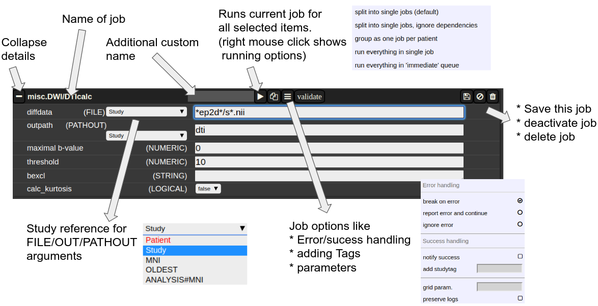
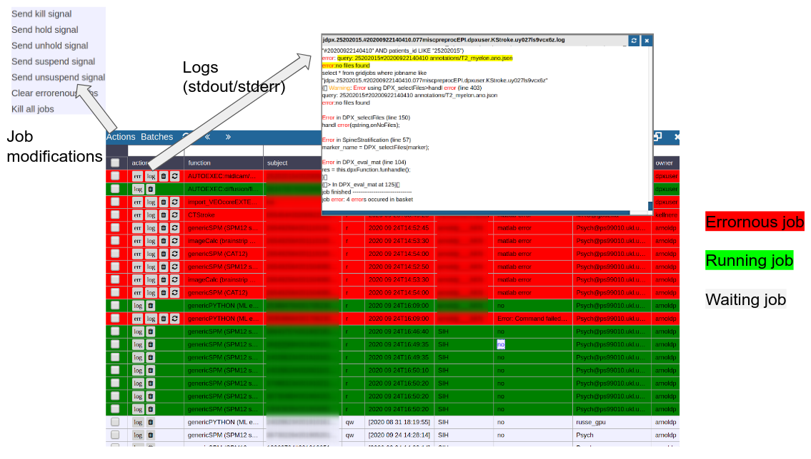

# Batchtool

#### The Batchtool Window

Consider Figure 2 below: the subject/studies table on the left is used for the selection of subject/studies on which you want to run your batch. You can use the filter bars to create the subgroup you want to work on (see [Subject/Studies table](projects-and-subject-studies.md)). Select "Batchtool" on the top toolbar (A) to open the batchtool. Figure 2 shows the structure of the Bacthtool window. It allows to compose the batch out of single jobs. Jobs are added from the menu (D). You can save batches (E), which then appear in the batch list (C). To open an overview of currently running jobs open the "Gridstats" window (B) or (H).

Batches are launched for every subjects/study independently in parallel. The jobs within a batch run sequentially. You can also choose different running option (see (G) in Figure 2). Depending on the selection level (subjects or studies), the batches are iterated over subjects or patients  
   
Imagine a scenario where you have multiple studies per patient, which have to be linked in some sense. Then, the subject level is appropriate. For example, think of a neuroimaging analysis where you a have a CT study (which contains, e.g. electrode information) and a MR study (which contains soft tissue anatomical information), or think of a simple longitudinal analysis. Otherwise, if your your studies should all be treated in an equal manner, the study level is appropriate.

##### **Figure 2: Batchtool overview.**

#### The Anatomy of a Job

A job consists of a list of arguments. There are several types of arguments:

- **FILE**  
    All input images/series (or any other type of files) are given as FILE arguments. Usually you give a file pattern instead of an explicit filename. A fIle pattern is a combination of subfolders, filename and wildcards. For example: **t1\*/s0\_\_.nii.** I refers to all files contained in a folder starting with t1 and whose filename matches "s0\_\_\_.nii" . The asterisks (\*) is a placeholder for an arbitrary character sequence, an underscore "\_" for a single character. Internally, the wildcards are the same as for SQL "like" statement (the '\*' is replaced by '%'). A FILE argument also includes a reference to a study or patient. Depending on the selection level (subject or study), different "study references" are possible. See below for more about "study references".
- **OUT**  
    A name of a file including the subfolder. No wildcards are allowed here. Depending on the selection level there are again different study references possible. A output file may be tagged by putting in the OUT field "myoutputfilename TAG(mytagname)".
- **PATHOUT**  
    Same as OUT but refers to foldername instead of a filename.
- **NUMERIC**
- **STRING**
- **LOGICAL**
- **OPTION**

##### Study References and study selectors
  

##### **Figure 3: The anatomy of a single job.**

#### Cluster Managment/Monitor (Gridstats)

To monitor the integrated cluster environment there is a simple table based overview, which provides accessto job logs and job modifications. One can also sort and search the current job statistics to selectively monitor or kill/suspend jobs. While finished jobs just disappear by default (you can change this in the settings), jobs that have produced an error are kept for further analysis. Note that the job information is also available on subject/study level (see Figure 2) as small indicators. To get further information about the job, you can click on the function cell and a JSON-representation of the job is displayed. A click on the subject cell selects the corresponding subject/study in the table.

##### **Figure 4: Gridstats: monitoring and control of the cluster environment/resource managment (Slurm/SGE)**
