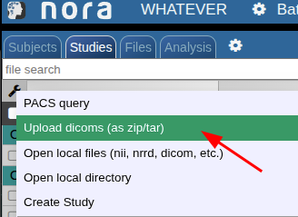

# Dicom import via HTTP POST

You can upload dicoms from command line via a REST API. For example, use wget/curl (linux) or iwr (Windows). Here is example using curl

```
curl "https://nora.ukl.uni-freiburg.de/godzilla/index.php?project=WHATEVER"\
        -F 'call={"cmd":"import","user":"donaldduck","token":"@CRYPT@yourtoken"}'\
        -F 'thefile=@/a/path/to/a/zipped/dicomfolder/data.zip;type=application/zip'
```

The data is uploaded and a job on the cluster is started for conversion to nifti.  
It's equivalent to using the web interface (Upload dicoms)


