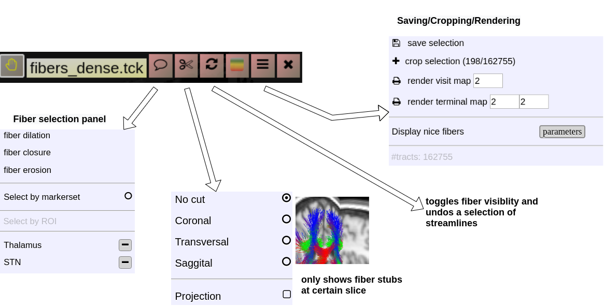

# Fiber Viewer

NORA includes fiberviewer based on webGL and Babylon.js. The main features are:

- Supports TCK (mrtrix) and TRK (TrackVis) formats
- Fiber Manipulations 
    - Interactive selection by variable sized spheres
    - Interactive deletion by variable sized sphere
    - Selection and Deletion of tracts by ROIs
    - Selection by sphere sets, (annotation type: poinset)
    - Selection by waypoints (annotation type: freeline)
    - Selection by DBS electrodes
- Rendering 
    - Vistmaps (fiber densities)
    - Terminalmaps
    - LIveupdate of visit/terminal maps
- Tracking 
    - a simplistic fibertracking algorithm based on tensor/orientationl fields is provided

#### Starting the fiber viewer

Choose an appropriate background image (like a T1w) and simply drop a tck or trk file into a viewport and the viewer will automatically switch to 3D mode a displays the fibers. An additional viewbar appears, which is associated with the loaded tracts. The viewbars allows you manipulate the streamlines, select subsets, etc. Here a short overview:

#### Fiber Selection

- **Manually:**  
    Hold **Shift key** pressed, a yellow sphere appears when hovering with mouse over the tracking, click to select all fibers going through the
- **By ROI:**
- **By Annotation:**

Cropping Selections and iterative selections.

#### Some slides explaining NORA' s fiber viewer

<iframe allowfullscreen="allowfullscreen" frameborder="0" height="569" src="https://docs.google.com/presentation/d/e/2PACX-1vQHKRtI4SmMgshiAfYBZ7xHqpXdtPu4gUSbiE2pQNvj9yhSejusYdoX8Xr0iryr-ETqMXQ1EZ0HBkzK/embed?start=false&loop=false&delayms=3000" width="960"></iframe>
