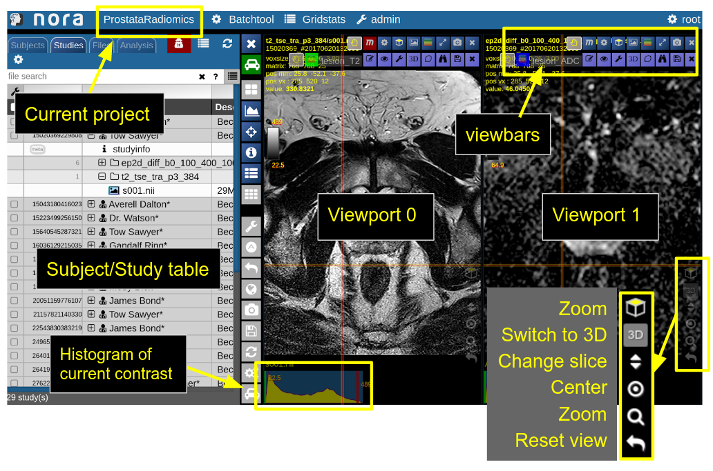
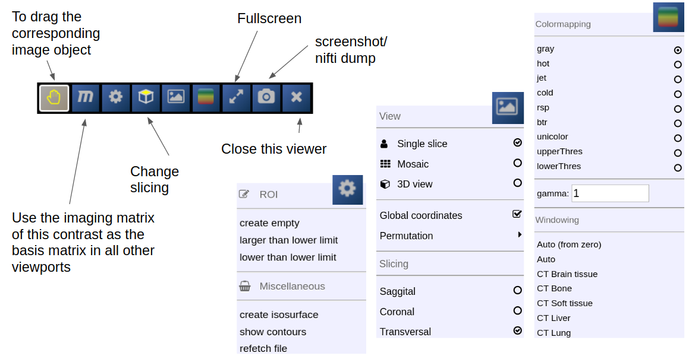
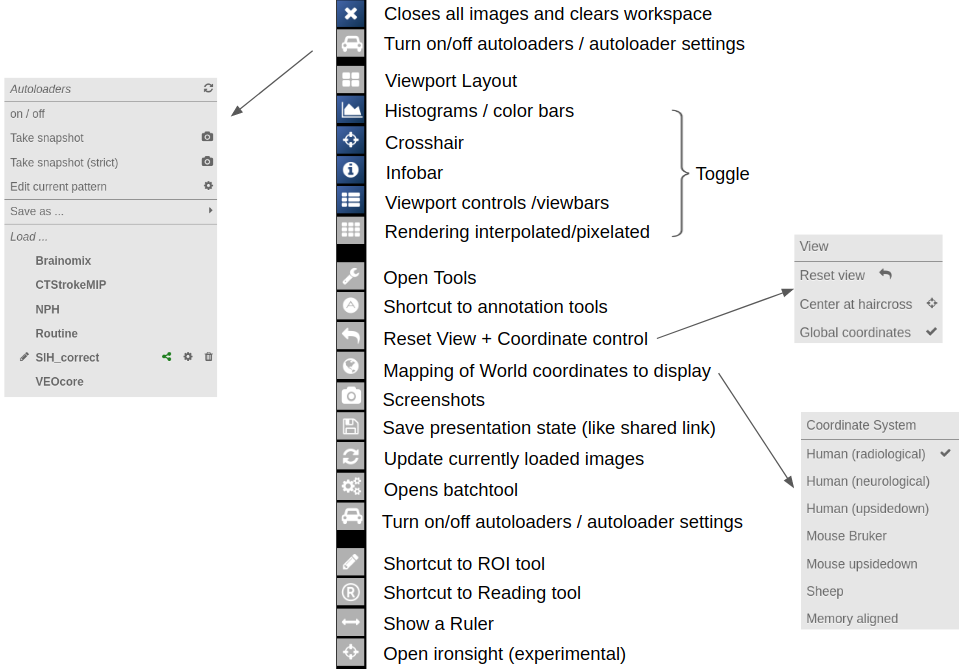
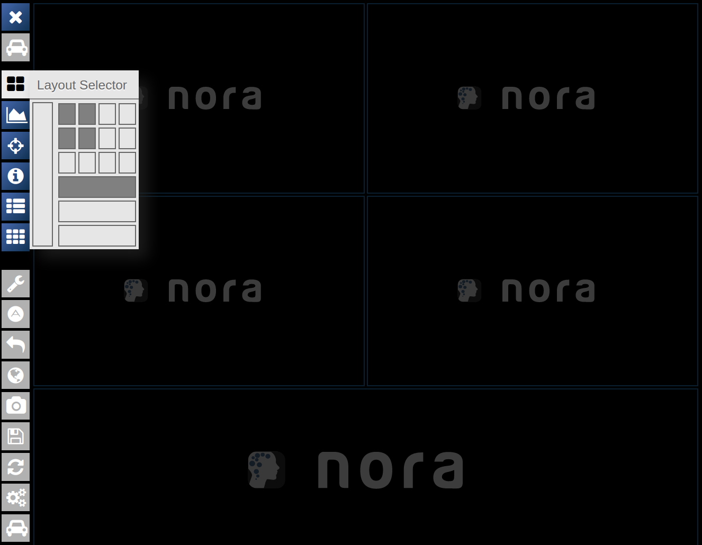

# First Steps

Learning by doing is most of the times the best option. So, try out the demos on

[https://www.nora-imaging.org/](https://www.nora-imaging.org/)

to get an inital experience. Note that there is also a non-web version of the viewer (packed in electron) to allow local non-internet usage of the viewer (download also [here](https://www.nora-imaging.org/))

#### NORA's desktop

NORA's basic working screen is like that:  
NORA's imaging data is organized in projects. Each projects contains a set of subjects/studies, which appear in the left table of the desktop.

Loading data for viewing happens in most of the cases per **drag&amp;drop.** You can drag images from the subject/study table (see [here](projects-and-subject-studies.md) for more about the table) into the viewports on the right. By **double-clicking** a file its content is loaded and placed into next available viewport. You can also **drag&amp;drop files from your local computer** into the viewports for visulization (note that the data is not uploaded, it stays on your local machine).

Depending on the file type different drop options appear in the viewports. For example, if you want to overlay one image onto another just drop on "drop as overlay". Hence, each viewport can contain multiple items: a background, overlays, masks, fibers and surfaces (in 3D) etc.. Corresponding to each item a **viewbar** appears in the upper right corner of the viewport. The viewbar controls the appearence of the associated object/contrast. Most properties (colormapping, outlines, etc.) are set for all instances of the object in all viewports. If you want to choose the same object to have different appearence properties in different viewports use the shift key while selecting the property.

The viewbar of the "background" image is organzed as follows

##### Central Toolbar

##### Viewports and Viewer Layout

To control the layout of the viewports use the layout selector located at the central toolbar. Note that for the horizontal viewports at the bottom a mosaic view is default.

##### Mouse

<table border="1" id="bkmrk-mouse-wheel-change-s" style="border-collapse: collapse; width: 100%;"><tbody><tr><td style="width: 50%;">Mouse wheel</td><td style="width: 50%;">change slice</td></tr><tr><td style="width: 50%;">Ctrl + Mouse wheel </td><td style="width: 50%;">zoom</td></tr><tr><td style="width: 50%;">Right mouse button (hold down)</td><td style="width: 50%;">pan</td></tr><tr><td style="width: 50%;">Left mouse buttom click</td><td style="width: 50%;">change position of crosshair (world position)</td></tr><tr><td style="width: 50%;">Middle mouse button</td><td style="width: 50%;">Change windowing</td></tr><tr><td style="width: 50%;">Ctrl + Left Mouse button hold</td><td style="width: 50%;">Reformatting MPR (rotation/translation) , see Navigation Tool</td></tr></tbody></table>

##### Keyboard Shortcuts

<table border="1" id="bkmrk-1-6%2C0-shortcuts-to-s" style="border-collapse: collapse; width: 100%; height: 140px;"><tbody><tr style="height: 28px;"><td style="width: 50%; height: 28px;">1-6,0</td><td style="width: 50%; height: 28px;">shortcuts to standard CT windowings</td></tr><tr style="height: 28px;"><td style="width: 50%; height: 28px;">Space</td><td style="width: 50%; height: 28px;">toggle ROI edit, see[ ROI tool](roi-tool.md)</td></tr><tr style="height: 28px;"><td style="width: 50%; height: 28px;">s</td><td style="width: 50%; height: 28px;">open settings window</td></tr><tr style="height: 28px;"><td style="width: 50%; height: 28px;">x,y</td><td style="width: 50%; height: 28px;">decrease/increase scroll speed</td></tr><tr style="height: 28px;"><td style="width: 50%; height: 28px;">arrow up/down</td><td style="width: 50%; height: 28px;">change subject (when using autoloader)</td></tr><tr><td style="width: 50%;">(shift) Ctrl-Z</td><td style="width: 50%;">Undo/Redo ROI drawing</td></tr></tbody></table>
