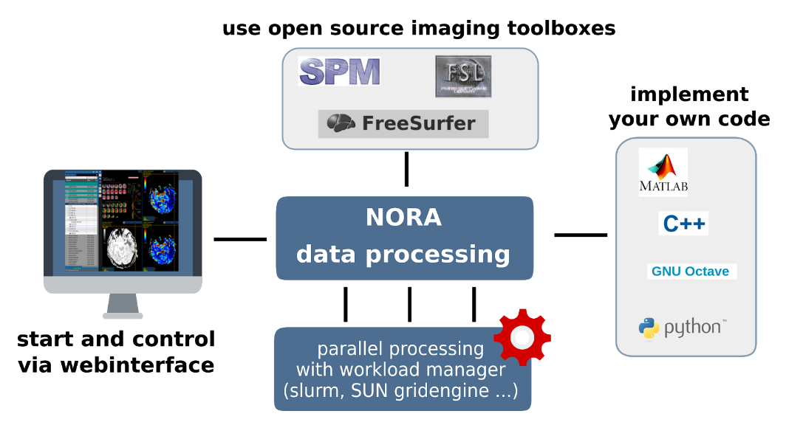

# General

The batchtool was created out of the needs to apply common neuroimaging pipelines (like SPM, FSL, Freesurfer) on medium sized projects (10-1000 subjects) in a convenient and efficient manner. One of the major objective of NORA's batchtool is to deal with heterogenous data. Typically, files (a.k.a. image series, or any other filecontent) are selected by file patterns, which can iteratively generalized. Errors can be easily tracked by a simple error logging system. For example, it is simple to select a errornous subgroup and rerun a modified job for them, which was corrected for the error. Processing pipelines (batches) are a simple linear series of jobs. Depending on the relationship between individual jobs, they can run serially or in parallel.

##### **Figure 1: Design principle**

In conclusion, what it provides:

- Convenient selection of subject/study sets to apply certain processing pipelines
- Definitions of inputs via Tags or filepatterns with wildcards
- Composition of processing pipelines based on predefined scripts/jobs (mostly MATLAB), or custom MATLAB/BASH/Python code
- Submission of jobs to a cluster (Slurm/SGE) with direct access to logs and errors
