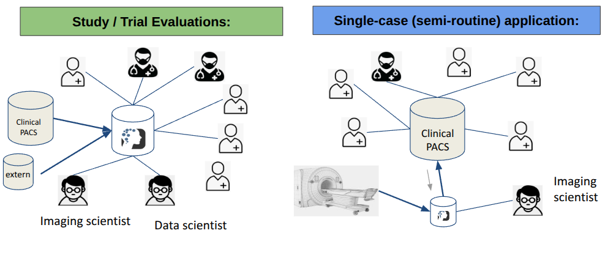

# Introduction

NORA is a web-based platform for medical imaging research that brings data access, curation, visualization, annotation, processing, and evaluation into one environment. Instead of splitting a study across separate viewers, scripts, storage systems, and ad-hoc exports, NORA is designed as an integrated workspace where researchers can move from image retrieval to quality control, annotation, AI-based analysis, and result review without leaving the platform.

It was developed from everyday clinical and research workflows in medical imaging, where large and heterogeneous datasets have to be imported from hospital systems, organized for projects, processed reproducibly, and shared across interdisciplinary teams. In practice, NORA connects image management, collaborative work, and scalable computation: users can browse and inspect studies in the browser, annotate findings, launch processing pipelines or AI tools, and link derived results back to the underlying imaging data and metadata.

This makes NORA useful for both focused project work and large-scale studies. Typical use cases include:

- retrieving image data from PACS or other archives and organizing it for research projects
- browsing large cohorts for quality control, triage, and collaborative review
- creating manual, semi-automatic, or AI-assisted annotations for segmentation, detection, or reading tasks
- running external processing tools, batch workflows, and cluster jobs on many subjects or studies
- collecting results, derived images, labels, and metadata in a shared multi-user environment

This documentation is meant for different kinds of users:

- end users who want to browse, annotate, and share imaging data
- researchers who want to import datasets, run processing jobs, or work with Jupyter notebooks
- administrators who need to install, configure, and maintain a NORA instance

Depending on the installation, NORA can support both local institutional deployments and more distributed research setups. The platform is meant to work with common medical imaging formats and standards, integrate external analysis toolboxes, and support reproducible workflows that remain practical under real-world constraints such as access control, privacy requirements, and heterogeneous compute infrastructure.

The chapters in this documentation are organized by task rather than by internal implementation. If you are new to NORA, a good path is:

1. Start with [What is NORA?](what-is-nora.md).
2. Continue with [First Steps](first-steps.md).
3. Move on to import, processing, and job-related chapters as needed.
4. Use the installation and administration chapters if you are setting up or maintaining an instance.

Some of these pages were normalized from an older BookStack export and are being cleaned up into repository-friendly Markdown. The goal of this version is to make the documentation easier to maintain, easier to navigate, and easier to extend alongside the codebase.

If you already know what you are looking for, the [documentation index](../index.md) gives a task-oriented overview of all available chapters.
