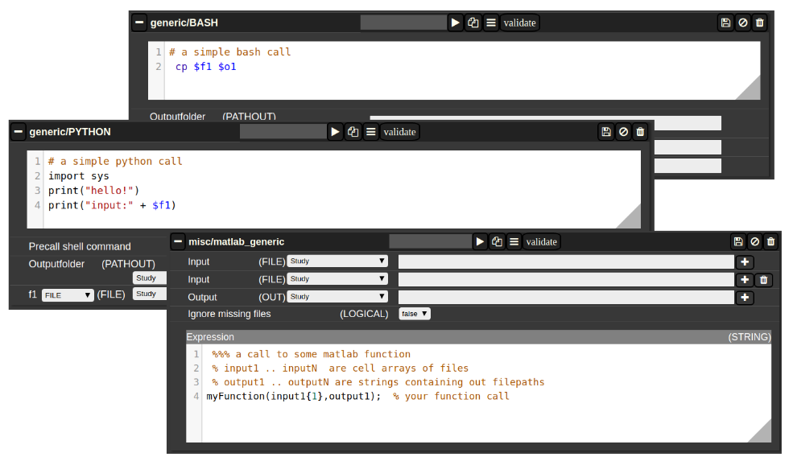

# Jobs

#### Generic jobs

There are a multitude of predefined algorithms (mostly MATLAB) in NORA; however you can also implement your own scripts directly by using generic jobs. Currently there are three types of languages possible:

- **BASH**
- **Python**
- **MATLAB**

A generic jobs basically provides a field where you can enter simple expression or a full script in BASH/Python or MATLAB. Arguments from NORA are passed to the script by simple variable naming conventions.

For **BASH/Python** scripts input files (and all other parameters) are referenced by variables with a $-prefix with a special naming convention. For example, file arguments are referenced by $f1-$f9. Once NORA finds such an expression it automatically adds a corresponding row at the bottom of the job, which can be filled by the appropriate file patterns. The same holds of output arguments (represented by $o1-$o9) and output paths (prefix 'p'). Other parameters (STRING,NUMERIC) are referenced by prefixes 's' and 'n'.

In **MATLAB** the approach is a little bit different. You can manually add input/output arguments by using the "plus" sign and refer to the arguments by ordinary MATLAB variables. As input you have a series of cell-Arrays (input1, ..., inputN), as output a series of strings (output1, ..., outputN).

The input and output filenames are resolved to absolute paths that may be used directly.

##### **Figure 4: Generic Jobs**

The Nora backend and related software is available to the jobs. The backend command is named nora. This allows bash jobs like: nora -a $1 --addtag mytagname. This example adds a tag to a file that was selected for processing, by making use of the backend.
