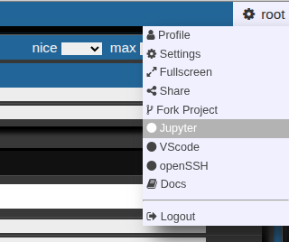
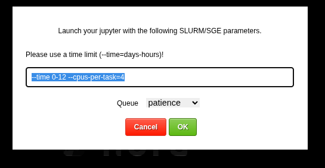
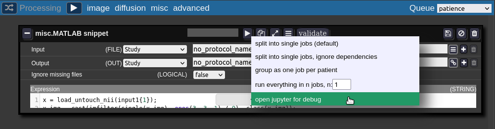
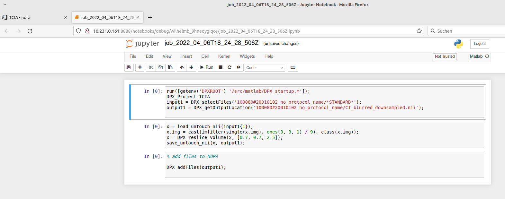
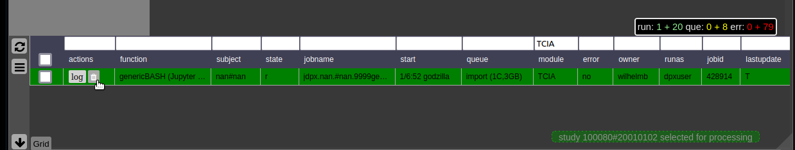

# Jupyter Notebooks

Nora allows to submit cluster jobs which launch jupyter lab. There are several ways:

1. Go to your right upper corner, and choose jupyter  
      
    This allows you to launch a jupyter lab on the cluster. You can choose slurm parameters for the job  
      
      
      
    The root folder of the notebook will be located on you persistent home folder on the cluster.
2. For debugging the batchtool can open a job in a jupyter notebook:  
      
      
    The jupyter notebook is opened in a new browser-tab (make sure your browser allows pop-ups for Nora):  
    

When working in a Jupyter terminal or Python notebook, the NORA backend CLI `nora` is often useful for project-aware operations without leaving the notebook environment. Typical examples are:

- selecting files with `nora -s ...`
- computing output paths with `nora --out ...`
- exporting metadata with `nora --exportmeta ...`
- launching or inspecting backend-oriented workflows from Python via the wrappers documented in [Administration Backend](administration-backend.md)

If the environment variable `DPXproject` is set in the notebook session, you can often omit `-p MYPROJECT`.

This also makes the Python wrappers in `src/python/nora` practical inside notebooks, especially `DPX_selectFiles`, `DPX_getMeta`, and `DPX_getOutputLocation`; see [Administration Backend](administration-backend.md).

When finished with debugging close the tab. Don't forget to kill the jupyter-notebook job in the grid view. The view may be opened on the bottom of the batch tool.

