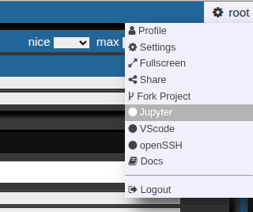
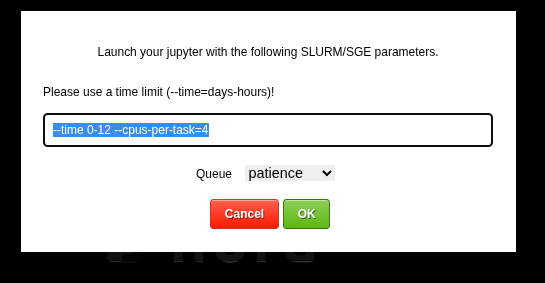
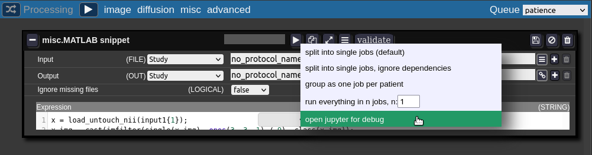
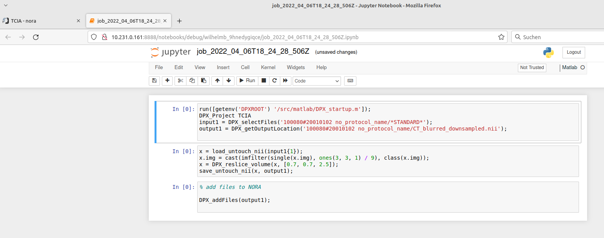
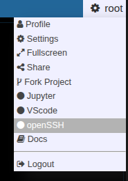
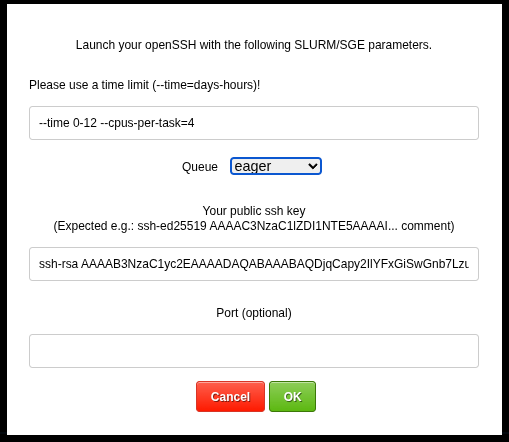
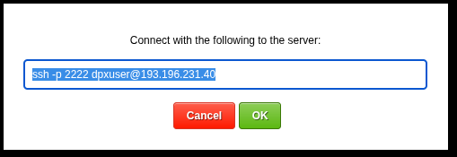
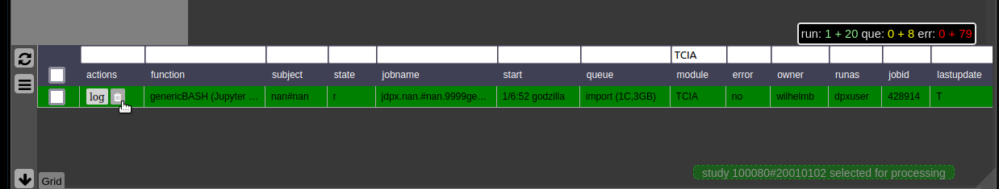

# Jupyter Notebooks

NORA can launch interactive cluster jobs for development and debugging. The most common options are:

- Jupyter Lab in the browser
- an OpenSSH job with its own `sshd`

These services do not run on your local machine. NORA submits a job to the cluster, starts the service inside that job, and then shows you how to connect to it.

For the administrator-facing setup behind these services, see [Interactive Development Services](interactive-development-services.md). For queue and jail behavior, see [Slurm, Queues, and Jails](slurm-queues-and-jails.md).

## How this works

The important principle is that you are opening your own interactive session on a compute node.

That means:

- the Jupyter server or SSH server runs inside your job on the cluster
- the available CPU time, memory, runtime limit, and queue selection come from that job
- files are visible only if they are mounted and reachable on that worker node
- the session has the software environment prepared by the NORA backend for interactive jobs

This is useful because your notebook or SSH session then sees the same backend-side data paths and compute environment as other NORA jobs.

In practice, NORA creates a user-specific interactive workspace below the configured notebook root. That workspace is persistent across sessions and is typically used as the effective home directory for interactive services.

## When to use this

Typical use cases are:

- exploring data with Python notebooks close to the backend storage
- debugging import, processing, or project-specific scripts
- unpacking uploaded archives on the backend side
- working on files through SSH, VS Code, or WinSCP without exposing a full system login

If you want to place files directly into backend project folders before registering them in the database, this is also the recommended path; see [Create Project From Existing Data](create-project-from-existing-data.md).

## Launch Jupyter Lab from the main menu

Open the menu in the upper-right corner and choose Jupyter:

This opens the launcher dialog for a Jupyter job on the cluster. You can choose the queue and other job parameters there:

After the job starts, NORA opens Jupyter Lab in a new browser tab. Make sure your browser allows pop-ups for NORA.

The notebook root is your persistent interactive workspace on the cluster, not your local desktop filesystem.

## Open a Jupyter job from the batch tool

For debugging a processing job, the batch tool can open a Jupyter job directly:

The notebook is then opened in a new browser tab:

This is useful when you want to inspect files, rerun commands manually, or debug logic in the same general backend environment where the processing job runs.

## Launch an OpenSSH job

You can also launch an OpenSSH job. In that case, NORA starts a job-local `sshd` inside the cluster job instead of opening a browser-based notebook.

Start it from the launcher:

Configure and submit the job in the dialog:

After the job is running, NORA shows the connection details:

This SSH endpoint belongs only to that running job. It is not a normal long-lived login node account. When the job ends, the SSH endpoint disappears as well.

If you connect from a plain terminal with `ssh`, start it with `-T` because this is not an ordinary PTY session. VS Code or WinSCP usage works as usual.

## What is special about the OpenSSH job

The OpenSSH mode is mainly for secure file access and remote editing inside the running job environment.

Compared with a normal cluster login, the important differences are:

- the SSH daemon is started only for your job
- the session inherits the job environment prepared by NORA
- access is limited to the lifetime and filesystem view of that job
- it is well suited for VS Code remote access, SFTP-style file transfer, or shell-based backend work

This is often the easiest way to upload an archive to the backend side, unpack it there, and then copy data into the correct project location.

## Working inside Jupyter or SSH

Once connected, you are working on the backend side. Typical tasks are:

- inspect shared data paths
- unpack uploaded zip archives
- prepare project folder structures
- run Python scripts near the data
- use the NORA backend CLI for project-aware operations

The NORA CLI `nora` is especially useful in Jupyter terminals, notebooks, or SSH sessions. Typical examples are:

- selecting files with `nora -s ...`
- computing output paths with `nora --out ...`
- exporting metadata with `nora --exportmeta ...`
- launching or inspecting backend-oriented workflows described in [Administration Backend](administration-backend.md)

If the environment variable `DPXproject` is set in the interactive session, you can often omit `-p MYPROJECT`.

This also makes the Python wrappers in `src/python/nora` practical inside notebooks, especially `DPX_selectFiles`, `DPX_getMeta`, and `DPX_getOutputLocation`; see [Administration Backend](administration-backend.md).

## What readers should keep in mind

Interactive jobs are convenient, but they still follow cluster rules.

- If the selected queue has short walltime, your notebook or SSH session may end sooner than expected.
- If files are not visible, the problem is usually the backend mount or jail view, not the browser.
- If software is missing, it may exist on the web node but not on the worker node that runs the job.
- Jupyter, SSH, and code-server sessions are backend tools; they are mainly for working close to the data and compute environment.

## Finishing and cleanup

When you are done, close the browser tab or SSH client, but also terminate the corresponding job in NORA. Otherwise the cluster resources remain allocated until the job ends.

You can inspect and kill the running interactive job in the grid view, for example at the bottom of the batch tool:

