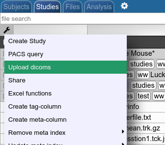
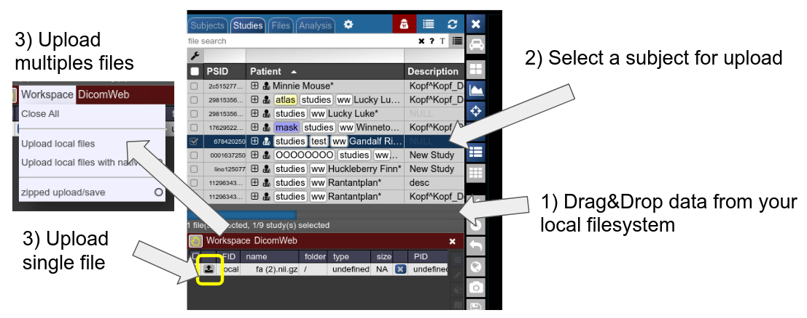

# Manual import

#### Upload as dicoms

Compress your dicoms into a zip-archive and upload the zip to NORA from here:



The dicoms are converted with the project specific policies to NIFTIs and imported into the project according to the meta data contained in the data (patient ID, study ID etc.). The import happens on NORA's computing servers.

Import from the server backend (from BASH console) is equivalently possible via

```
nora -p y YOUR_TARGET_PROJECT --import location_of_folder_or_zip
```

#### Upload NIFTIs etc.

Any file which is accepted by the viewer and registered by NORA as a proper file can be uploaded into a selected subject. Use drag&amp;drop from your local filesystem to NORA's desktop (1), then select a subject/study as target for upload and upload the data (2). The, just use the menu or the upload buttons to upload the files (3). You can also decide for zipped upload. If the dropped data also contain meta information (like DICOMs are Bruker imaging data), you can also use this information during upload for the subject/study assignment: just use "Upload local files with native PID" for uploading the files. If the corresponding subject is not existing in the project, the study is automatically created.


