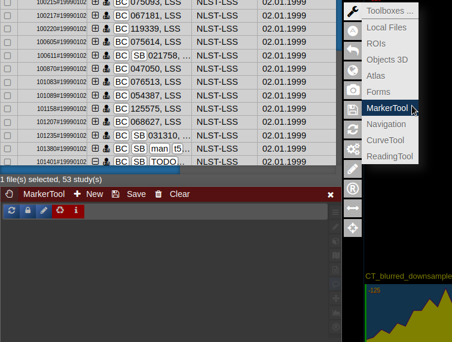
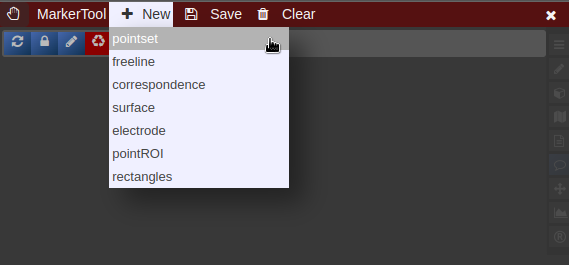
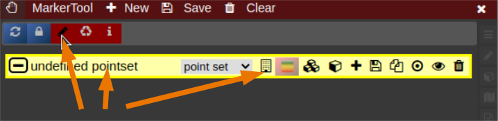
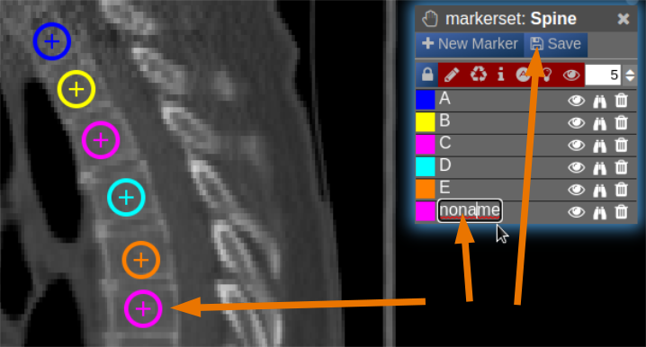

# Marker-Tool

The Marker-Tool enables other types of labels, for instance point-labels.

- To open it click on the wrench symbol an select "Marker Tool".
- To create a new pointset go to the menu of the Marker-Tool and select "new+" -&gt; "pointset".
- The pointset can be renamed by clicking on the text in the yellow bar. To enable a list view closer to the image, select the respective list symbol from the yellow bar. To enable adding points by clicking on the image, select the pen symbol.
- Now points are added by clicking on the image. The points are renamed by selecting the text in the list. When finished the pointset must be saved by clicking on the "Save" button. The pointset is stored in a subfolder "annotations" of the current patient.

<table border="1" id="bkmrk-%C2%A0-0" style="border-collapse: collapse; width: 100%;"><tbody><tr><td style="width: 50%;"></td><td style="width: 50%;"></td></tr><tr><td style="width: 50%;"></td><td style="width: 50%;"> </td></tr></tbody></table>
