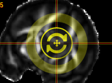
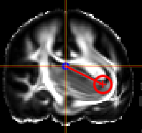
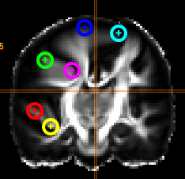
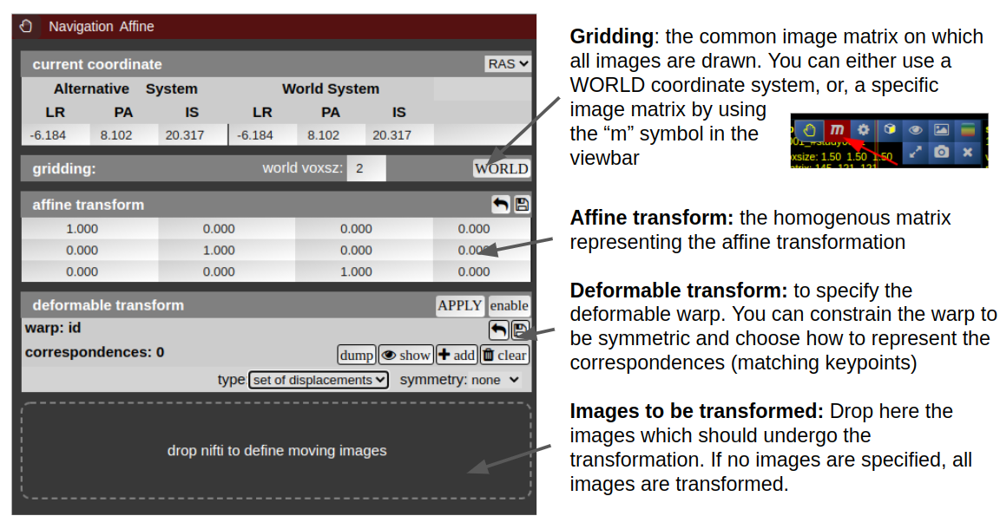

# Navigation Tool (alignment and deformations)

NORA provides the possibility to manually align volumetric images (nifits) in a rigid (affine) and deformable fashion. You can interactively **translate/rotate/scale the images by holding the Ctrl-key and using the mouse** with the yellow crosshair symbol. The deformable transformation is specified by either a set of displacements, or by two set of matching keypoints.

 

The navigation tool is organized as follows:

By default, all images are transformed/moving. You can also specify the "moving" images by dropping the nifti into the navigation tool. The moving images are shown in the lower box of the tool. Using the APPLY button(s) the current transformation is applied and written to the niftis defined as 'moving'.

Transformation results are only displayed when the "gridding" is defined to be on one common image matrix. Use either the "world"-image matrix by clicking on the WORLD button or use the "m" symbol on the viewbar of a specific nifti to use the image matrix of this specific nifti. The "world"-system uses a matrix with bounding box including all visible niftis and the voxel size given.

#### Deformable transformations (warping)

To create a warp field, press the "enable" button in the deformable transform section. By default you can add displacement markers ("correspondences") by pressing the "add" button. The size of the marker defines the extent of the displacement. You can combine multiple displacements. Each displacement is represented by a Gaussian shaped displacement field. By pressing the "dump" button, the displacements markers are rendered as a combined displacement field and markers are deleted. On top of this "dumped" displacement field you can now add again new displacements. Instead of using displacements, one can use two sets of keypoints. Therefore, choose in the "type" combo-box "pair of sets".
