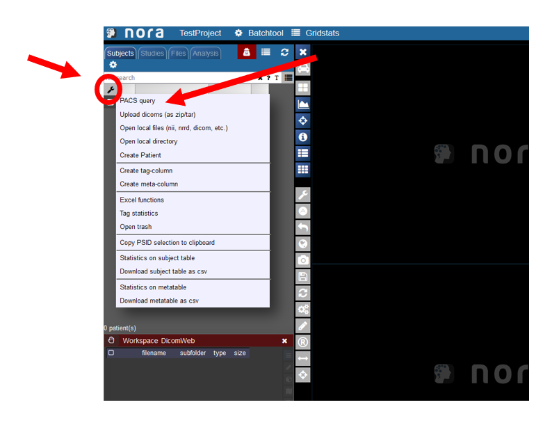
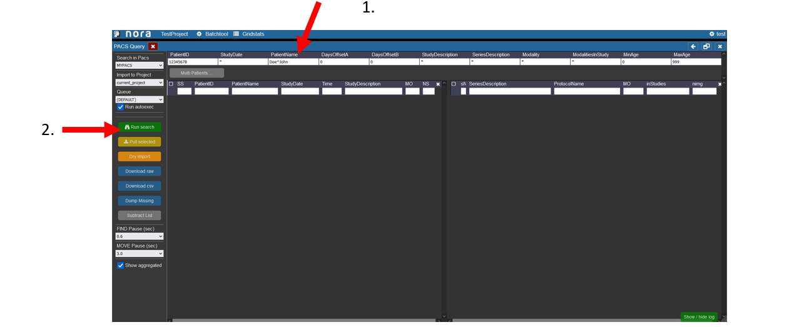
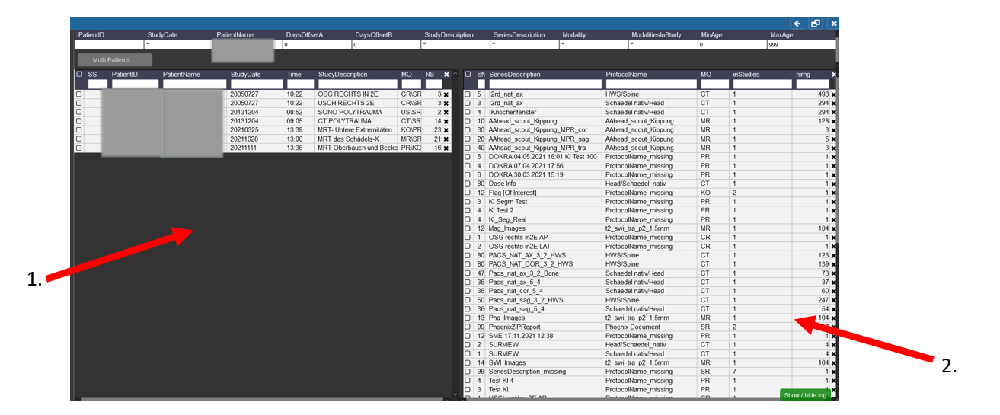
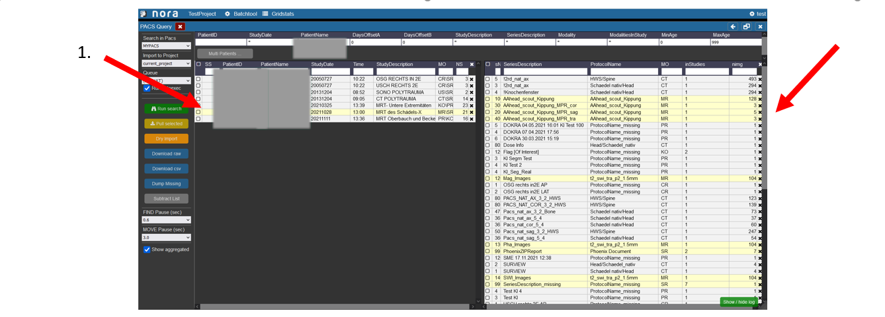
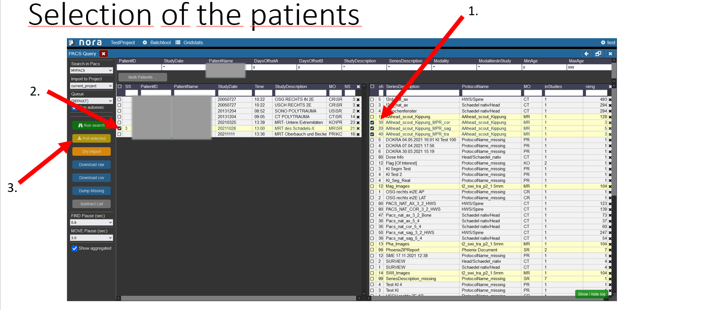
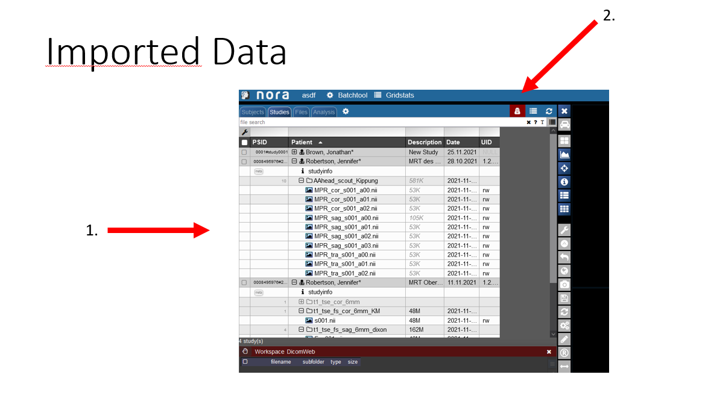

# PACS Querier

### Starting the PACS Query Tool

To start the PACS query tool click on the wrench symbol in the upper left corner. Then click on PACS Query.

### Overview of the Query Tool GUI

In this window users can search for patients in the pacs.   
1\. Enter the data of the patient, the patient ID tag can be left empty, in the study date there must at least be a star if the right date is not known. For the PatientName it is important that the lastname is seperated by a ^ from the first name. Depending on your PACS system it might be necessary to always use the full name and appreviations are not accepted.  
2\. Start the search by hitting the Enter key or clicking on Run Search in the left menu.

### Patient Search in the Query Tool

1\. On the left side you can see the different Patients with the Names, etc you searched for and the different visits/examinations  
That were done for them.   
2\. Here the different procedures and sequences are listed that you can import into Nora. If the Sequence was acquired for more than one patient or examination there  
Is then a number higher than 1 in the Tab inStudies.

### Highlighing of Examinations for a Patient

1\. To highlight which examinations belong to which patient click on the patient in the left table.  
2\. Then the examinations which were made during the selected visit of the patient are marked in the right table.

### Selection of the patients

1\. First select the examinations you want to import by clicking on the box on the left.   
2\. In the left table the amount of examinations you selected on the right is showing to which patient they belong, you now have to select the patient by checking the box.  
3\. To start the import into nora click on the button „pull selected“.

### View of the imported Data

1\. Now you can see you imported patient with his examinations.  
2\. If you click on the symbol the pseudonomyization is deactivated and the real name of the patient is shown. So do not wonder If the name that is initially displate is not the right name.
