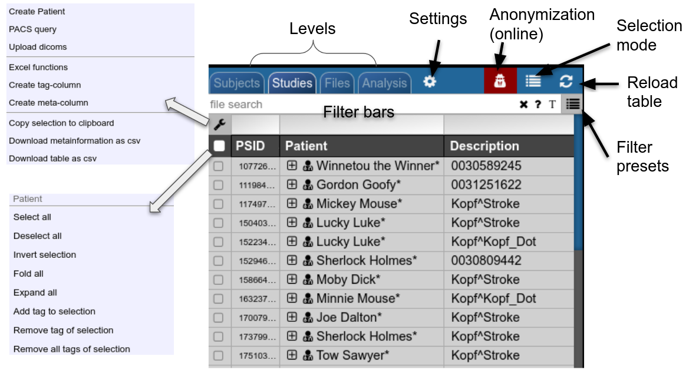

# Projects and Subject/Studies

#### Projects

NORA's subject pools are called "Projects". Each user has rights to see a certain subset of projects. The subject/study table on NORA's desktop shows only the subjects/studies of the current project. Projects can differ in their nameing conventions (anonym) and way of storing the data in the backend. They can also have custom processing functions and autoexecution queues.

#### Subjects/Studies

#### Filterbars

Use the filter bars to select a subset of studies/subjects. All bars share the following funtionalities: multiple queries are separated by spaces and are interpreted as a "OR" concatenation. If you want to combine expressions that have to be simultanously fulfilled use an explicit "&amp;" sign. All expression have implicity a wildcard at the end of the pattern. For example, search for all patients, whose given name start with A or B, write "A B" into the filter bar of the name column. The "file search" bar can be used to select studies that contain files which match the given file pattern. Explicit wildcards are \* and \_, where \* represents zero or more arbitrary characters and \_ represents exactly one abitrary character.

Examples for file searches:

- All studies that have a T1 from a trio: `t1_trio*/s0*.nii`
- Sometimes naming conventions are different, so use multiple queries: `t1_trio*/s0*.nii MPR_t1*/s*.nii`
- If you want to restrict for those which have specific study tag:`t1_tri*/s0*.nii & STAG:control`

There are special search attributes:

STAG, PTAG, FTAG, JOB, SDESC

For example, search for all studies, which have the tag "control"

`STAG:control`

Jobs can be queues (q) or running (r) or errornous (e). Find all subjects that have an errornous job

`JOB:e`

#### Using Tags

Subjects, studies and files can be decorated with tags. Use the context menu to assign tags. Tags help to group and label items. Files can have special tags
