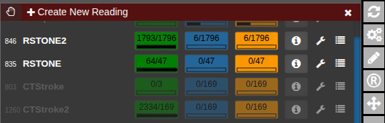
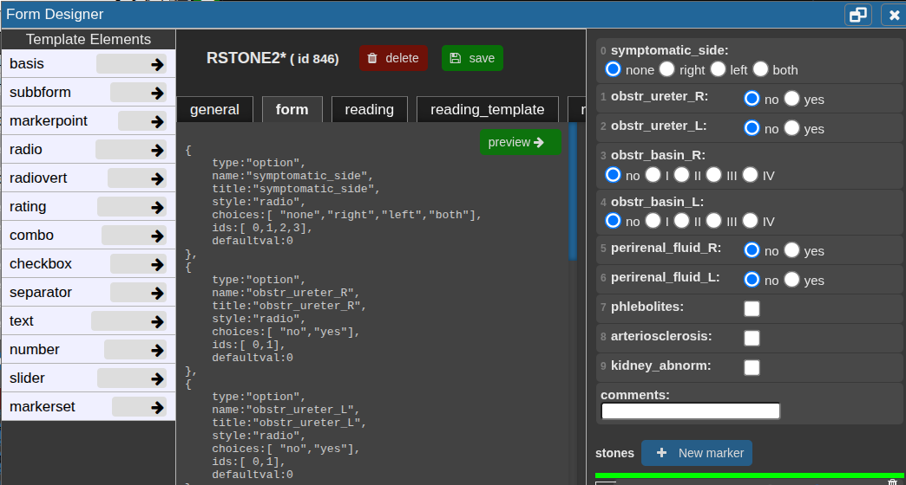
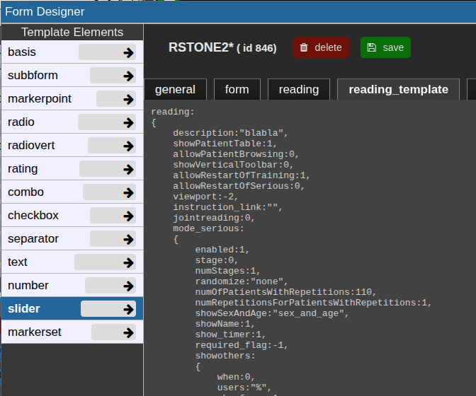

# Reading Tool

#### Overview

The **Reading Tool** enables structured and controlled reading sessions for medical imaging studies. It is designed for both **individual** and **multi-reader** scenarios — supporting reproducible reading performance measurements, rater comparison, and annotation-based tasks.  
Readings can be configured flexibly: randomized, blinded, repeated, or staged, depending on the study design. Results are stored securely and can be reviewed or exported by reading administrators.

#### Use Cases

- **Controlled Reading Studies:** Measure inter- and intra-rater performance, reproducibility, or the impact of AI assistance.
- **Annotation Tasks:** When a single reader annotates or tags cases manually, using the patient table and tag system may be more practical.
- **Training Scenarios:** Allow readers to familiarize themselves with representative cases before entering a serious reading phase

#### Key Features

1\. Forms &amp; Rating

- Create **rating forms or questionnaires** using the form designer.
- Readers fill out these forms during reading sessions.
- Form items can optionally be linked to **tags** in the patient or study table.

2\. Image Interaction

- Draw **annotations**, **points**, or **ROIs** directly on the images.
- Combine with predefined **autoloaders** to automatically load the correct images and view settings.

3\. Reading Modes

- **Individual Mode:** Each rater works independently.
- **Joint Mode:** Multiple raters collaborate on the same session.
- **Blind Modes:** Control what metadata or previous results are visible to the reader.

4\. Randomization &amp; Repetition

- Readings can be randomized per patient, study, or image.
- **Repetitions** are supported to evaluate reproducibility.
- Randomization can be **deterministic** or **fully random**.
- **Staged Readings:** Different stages can present varying image contexts (e.g., raw vs. AI-assisted).

5\. Training vs. Serious Mode

- **Training Mode:** Assign selected cases for practice.
- **Serious Mode:** Conduct the actual study under controlled conditions.

6\. Workflow Control

- Access to the patient table can be **restricted or detached** for fully controlled sessions.
- **Timing** of each reading is automatically tracked.
- Optionally include **reading instructions or external links** (e.g., Google Slides presentations).

#### Data & Results

- All form entries, annotations, and timing data are stored in the NORA database.
- Reading results can be reviewed and exported as **CSV** files by the reading administrator.

### Usage of Reading Tool

Open the reading tool (R) in vertical toolbar 

A list of all readings you have permission to access will appear.

 

The current progress for each reading is displayed as a numerical indicator showing how many cases have been completed out of the total. To start or continue a reading, click the corresponding button. If available, the **Info** button opens the reading instructions provided for that session. The **Wrench** button allows editing of the reading configuration, while the **List** button displays the collected reading results. To check for newly assigned readings or updates, click **Refresh from Server** to synchronize with the latest data.

#### Configure a reading

Click **Create New Reading** or the **Wrench** button to edit an existing one. The **Form Designer** will appear.

##### **general** tab

In the **general** tab, basic settings can be set.

##### **form** tab

In the **Form** tab, define the reading form using JSON code.  
Click a **template element** on the left to copy its JSON snippet, then paste it with **Ctrl+V** or click the **arrow** to insert it directly at the cursor position.  
Use **Preview →** to check the JSON and view the rendered form on the right.  
Add the property `"useastag": 1` to radio or checkbox elements if you want them to act as tags in the patient table.

##### **reading** tab

This json contain the reading configuration. It consist of several major variables: **reading, tools,** and **viewer.** Most properties are self-explanatory; additional details for specific options are provided below.

For a new reading, it may be empty. If so, go to the **reading\_template** tab and copy the relevant code to start.  
The **reading\_template** contains a template for a basic reading. The **viewer** property always contains the current viewer settings including the autoloaders.   
So if you want to change the autoloader / viewer settings, you can modify your current view accordingly, go to reading\_template, at copy only the viewer portion or the relevant parts of it.

  

##### Training and serious mode

The properties **mode\_serious** and **mode\_training** define the respective configurations for these two stages.  
Typically, training cases are marked with a study tag such as `"training"` and selected using an SQL condition like:  
`SQLCondition: "STAG LIKE '%Training%'"`.  
This allows readers to practice on predefined cases before proceeding to the serious reading phase.

##### Randomization

<article class="text-token-text-primary w-full focus:outline-none scroll-mt-[calc(var(--header-height)+min(200px,max(70px,20svh)))]" data-scroll-anchor="true" data-testid="conversation-turn-16" data-turn="assistant" data-turn-id="request-WEB:997ae3f9-2f33-4eaf-a31f-47e7718c60fd-112" dir="auto" id="bkmrk-by-default%2C-readings" tabindex="-1">By default, readings follow the order defined in `viewer.sortOrder` and `viewer.sortDirection`.  
To enable randomization, adjust the **random** property with one of these options:

- `"none"` – no randomization (default)
- `"full"` – generates a completely random and unpredictable order for each user and session.
- `"idhash"` – creates a hash based on the `StudyID`, resulting in a random but **reproducible** order that remains consistent across users and sessions.

  

##### Testing, debugging and restart

with the options `allowRestartOfTraining` and `allowRestartOfTraining` the respective reading can be restarted, i.e. all previous results of the current user will be deleted.  
This is typically good for testing, but not required and desired in the final reading.  

After changes in the rading, click on "save". Then click on "refresh list from Server" in the Reading tool. The reading statistics etc will then be updated.  
To start reading, click on the respective buttons. 

</article>

##### Important Notes

Always test a complete reading run first — ideally on a small subset of cases defined through the **SQLCondition** — to ensure that all settings and logic work as intended.  
After the test, review the **results table** to verify that data is stored and displayed correctly.  
Before starting the official reading and involving other readers, it is strongly recommended to consult with the **system administrators** to confirm that the setup is correct and stable, avoiding wasted time and effort.

