# ROI-Tool

### The ROI-Tool

The term Region of Interest (ROI) is used throughout the tutorial as a synonym for a "Mask", "Binary Mask", "Segmentation" or "Volume of Interest". Technically, it is a binary 3D volumetric image matrix, which is quite similar to **3D image** apart from the fact that voxel values are binary (on or off). Thus, a ROI has also the same properties as image (like resolution and matrix size). ROIs can also be just 2D, however, one has to be remember that the 2D slice has also a position in 3D space, which can sometimes be confusing.  
ROIs are close to what is represented by DICOM SEG objects.

To open the **ROI-tool** just go via the toolbox menu of the vertical iconbar or use the shortcut via the "pen" icon:

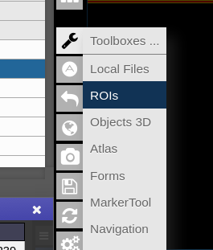 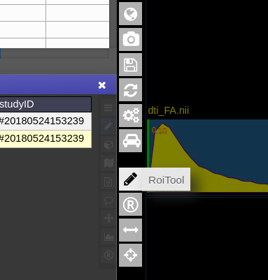

This opens the following toolbox window, which contains the access to all functionalities of the ROI-tool

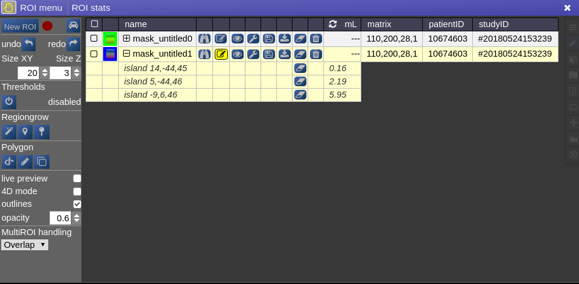

On the right you have list of currently opened ROIs togeter with information about matrix size and patientID/studyID. There is also information about the size of ROI and several tool icons:

<table border="1" id="bkmrk-focuses-the-position" style="border-collapse: collapse; width: 52.8205%; height: 296px;"><tbody><tr style="height: 10px;"><td style="width: 7.26496%; height: 10px;"></td><td style="width: 92.735%; height: 10px;">focuses the position of the viewer to the center of gravity of the current ROI

</td></tr><tr style="height: 43px;"><td style="width: 7.26496%; height: 43px;">

</td><td style="width: 92.735%; height: 43px;">turns the ROI to be the "current ROI" on which currently is drawn on</td></tr><tr style="height: 44px;"><td style="width: 7.26496%; height: 44px;"></td><td style="width: 92.735%; height: 44px;">toggles the visiblity of the ROI in all viewports</td></tr><tr style="height: 42px;"><td style="width: 7.26496%; height: 42px;"></td><td style="width: 92.735%; height: 42px;">open several options to modfiy ROIs (see below: ROI operations)</td></tr><tr style="height: 43px;"><td style="width: 7.26496%; height: 43px;"></td><td style="width: 92.735%; height: 43px;">save the ROI (upload to server)</td></tr><tr style="height: 42px;"><td style="width: 7.26496%; height: 42px;"></td><td style="width: 92.735%; height: 42px;">downloads the ROI to your local computer</td></tr><tr style="height: 43px;"><td style="width: 7.26496%; height: 43px;"></td><td style="width: 92.735%; height: 43px;">erases/clears all on voxels of the ROI</td></tr><tr style="height: 29px;"><td style="width: 7.26496%; height: 29px;"></td><td style="width: 92.735%; height: 29px;">deletes the ROI from workspace</td></tr></tbody></table>

#### Drawing and Pens

Generally, the **left mouse button turns voxels on,** while **right mouse button eraśes** voxels. Drawing happens always on the ROI which is currently selected for drawing. You can select   
a ROI for drawing by highlighting the pencil icon in the viewbar, or in the ROItool

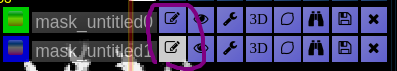 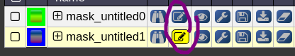

A shortcut for switching drawing on/off you cane use the **spacebar**. You can also **hold shift pressed** while being in drawing mode to disable mouse drawning features.

On the left panel of the ROI-tool the current type of pen mode (pen type) and the size of the pen can be set. You can turn on "**live preview**" to see what the current pen would draw. Displayed **opacity** of the ROI can be determined and whether **outlines** are drawn. The available pen types are as follows:

<table border="1" id="bkmrk-%C2%A0-%C2%A0-%C2%A0-%C2%A0-%C2%A0-%C2%A0-%C2%A0-%C2%A0-%C2%A0-%C2%A0" style="border-collapse: collapse; width: 53.5043%; height: 145px;"><tbody><tr style="height: 29px;"><td style="width: 5.11182%; height: 29px;">

</td><td style="width: 44.543%; height: 29px;">##### **Thresholding based pen**.

Depending on the threshold (either choose clImL/R or an actual number) the pen turns voxels ON, which are above ("Higher") or below ("Lower") the threshold. Additional you can select "Higher RGrow"/"Lower RGrow" to enforce the ON voxels to be connected to the central voxel.

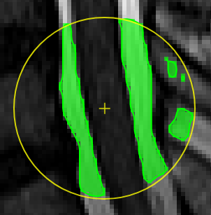

</td></tr><tr style="height: 29px;"><td style="width: 5.11182%; height: 29px;">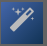

</td><td style="width: 44.543%; height: 29px;">##### **Magic pen (unconnected)**.

Turns voxel ON, which have a 1) similar contrast compared to the central voxel, 2) are within pen's radius. The similarity depends on the color limits chosen for the current contrasts.

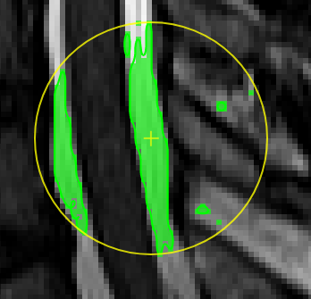

</td></tr><tr style="height: 29px;"><td style="width: 5.11182%; height: 29px;">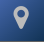

</td><td style="width: 44.543%; height: 29px;">##### **Magic pen (connected)**.

Turns voxel ON, which have a 1) similar contrast compared to the central voxel, 2) are within pen's radius. and 3) are connected to central voxel via a **region growing approach.** The similarity depends on the color limits chosen for the current contrasts.

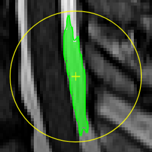

</td></tr><tr style="height: 29px;"><td style="width: 5.11182%; height: 29px;">

</td><td style="width: 44.543%; height: 29px;">##### **Unconstrained 3D region Growing.** 

Select a pixel by keeping left mouse button pressed. By moving the mouse left/right (while mouse pressed) the similarity threshold can be changed.

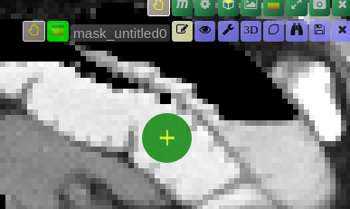

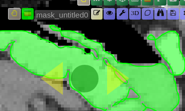

</td></tr><tr style="height: 29px;"><td style="width: 5.11182%; height: 29px;">

</td><td style="width: 44.543%; height: 29px;">##### **Polygontool**

Use the polygon tool to determine a ROI by its outline. You can either create the outline by holding the mouse button down, or click by click. You can also move points of the outline manually after creation. Use trashcan to delete outline, use the pencil to render the polygon into the current ROI enabled for drawing.

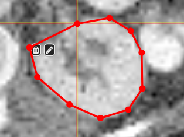

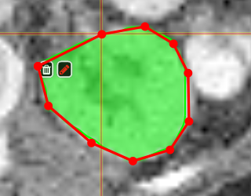

</td></tr></tbody></table>

#### Creating a ROI

To create you always have to give a reference on which basis the underlying geometry the ROI is created. There are several ways to do this:

1. Take an existing onto ROI-tool by dragging the hand-icon  
    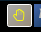   
    from the viewbar of the image (or the file from patienttable) and decide on the type of creation  
    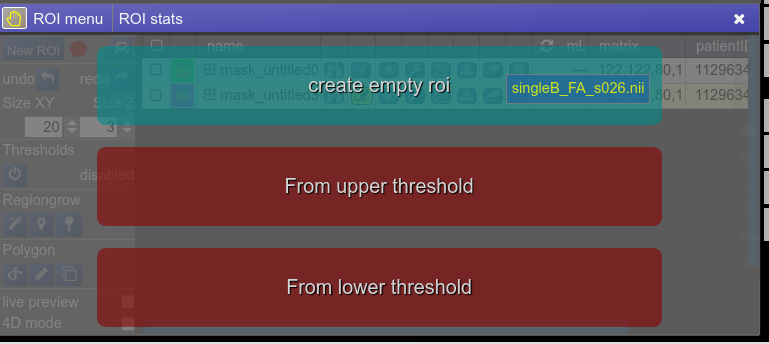  
    The threshold for creation is the lower limit of the current windowing of the contrast
2. Or use the cog-wheel item of the viewbar to do the same thing.  
    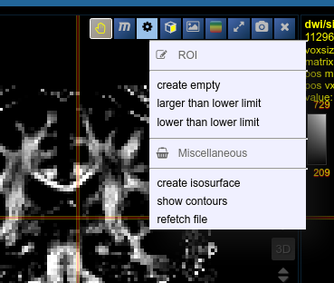
3. Or just use the "New ROI" button in ROI-tool itself.

#### ROI operations

- **Morphological Operations:** NORA provides the typical 4 operations (erosion, dilation, opening and closing) using a 6-neighborhood in the slicing of the ROI matrix, i.e. the size of the neighborhood varies depending on the underlying matrix size.
- **Set Operations:** NORA provides intersection, union and set difference. Select
- **Remove Salt:** Does a connected component analysis and removes components than the given threshold.

#### ROI statistics

Open the ROIstats window by clicking on the menubar in the ROI-tool

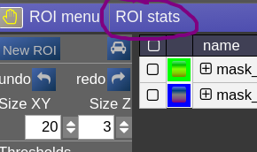

The ROI statitics table appears which computes for all possible combinations of contrasts and ROIs currently present in the viewer the following statistics:

- median of contrast (percentile 50%)
- iqr1/iqr2 - inter quartile ranges (percentile 25% and 75%)
- mean/std - mean and standrad deviation
- volume (in mL)
- area (in cm2, makes only sense when ROI is 2D, or a single slice in the matrix)

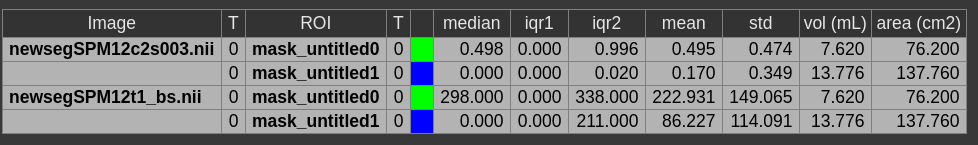
