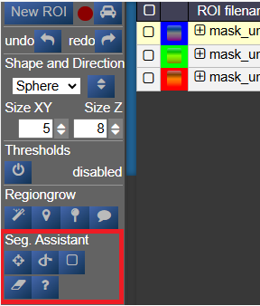

# Segmentation Assistant for ROItool (nnInteractive)



This assistant allows users to create and refine 3D ROIs using interactions. Images, masks, and successive interactions are processed by a deep learning model hosted on a remote server.

The current version of the model is **nnInteractive** (Isensee, Rokuss, Krämer et. al., 2025). [nnInteractive repository](https://github.com/MIC-DKFZ/nnInteractive)

## 1. Usage

First, **select an ROI** from the ROI list to make it the active target for segmentation.

### Point Interaction

- Click the **Point** icon (crosshairs) to activate Point mode
- **Left-click** on the image to add a **positive** point (to include an area)
- **Right-click** on the image to add a **negative** point (to exclude an area)
- The segmentation will be updated immediately. Click the icon again to deactivate
- To add multiple points before updating the segmentation, **hold down the Q key** while adding points. Release the Q key to send all accumulated points at once

### Scribble Interaction

- Click the **Scribble** icon to activate Scribble mode and draw a scribble on the image
- Click the **+** button to run a **positive** interaction (add areas)
- Click the **-** button to run a **negative** interaction (remove areas)
- Scribbles are cleared after each interaction, allowing you to add more

### BBox Interaction

- Click the **BBox** icon (square) to activate Bounding Box mode and draw a box on the image
- Click the **+** button for a **positive** interaction (segment inside the box)
- Click the **-** button for a **negative** interaction (exclude area in the box)
- The box is cleared after each interaction

### Reset Interactions

- When editing the same ROI, all previous interactions are kept in memory server-side to guide the segmentation
- Click the **Reset** icon (eraser) to erase all previous interactions and start fresh

## 2. Server Setup

The segmentation server must be running, typically on a machine with a GPU. First, navigate to the `src/python/segmentation_assistant_server` directory and launch the `setup.sh` script (requires internet access):

<div class="relative group/copy bg-bg-000/50 border-0.5 border-border-400 rounded-lg" id="bkmrk-bash"><div class="sticky opacity-0 group-hover/copy:opacity-100 top-2 py-2 h-12 w-0 float-right"><div class="absolute right-0 h-8 px-2 items-center inline-flex z-10"><div class="relative"><div class="flex items-center justify-center transition-all opacity-100 scale-100"><svg aria-hidden="true" class="shrink-0 transition-all opacity-100 scale-100" fill="currentColor" height="20" viewbox="0 0 20 20" width="20" xmlns="http://www.w3.org/2000/svg"></svg>  
</div><div class="flex items-center justify-center absolute top-0 left-0 transition-all opacity-0 scale-50"><svg aria-hidden="true" class="shrink-0 absolute top-0 left-0 transition-all opacity-0 scale-50" fill="currentColor" height="20" viewbox="0 0 20 20" width="20" xmlns="http://www.w3.org/2000/svg"></svg>  
</div></div></div></div><div class="text-text-500 font-small p-3.5 pb-0">bash</div><div>  
</div></div>```bash
cd src/python/segmentation_assistant_server
./setup.sh
```

This will create a Python virtual environment and install the necessary dependencies.

Next, start the server from a computing node with:

<div class="relative group/copy bg-bg-000/50 border-0.5 border-border-400 rounded-lg" id="bkmrk-bash-1"><div class="sticky opacity-0 group-hover/copy:opacity-100 top-2 py-2 h-12 w-0 float-right"><div class="absolute right-0 h-8 px-2 items-center inline-flex z-10"><div class="relative"><div class="flex items-center justify-center transition-all opacity-100 scale-100"><svg aria-hidden="true" class="shrink-0 transition-all opacity-100 scale-100" fill="currentColor" height="20" viewbox="0 0 20 20" width="20" xmlns="http://www.w3.org/2000/svg"></svg>  
</div><div class="flex items-center justify-center absolute top-0 left-0 transition-all opacity-0 scale-50"><svg aria-hidden="true" class="shrink-0 absolute top-0 left-0 transition-all opacity-0 scale-50" fill="currentColor" height="20" viewbox="0 0 20 20" width="20" xmlns="http://www.w3.org/2000/svg"></svg>  
</div></div></div></div><div class="text-text-500 font-small p-3.5 pb-0">bash</div><div>  
</div></div>```bash
cd src/python/segmentation_assistant_server
./start.sh
```

## 3. Client Configuration

Once the server is running, it will log its port. You must update this client's configuration to point to that address.

Edit the file: `conf/segmentationserver.conf`

Set the `REMOTE_SEGMENTATION_BASE_URL` to the server's address, for example:

<div class="relative group/copy bg-bg-000/50 border-0.5 border-border-400 rounded-lg" id="bkmrk-json"><div class="sticky opacity-0 group-hover/copy:opacity-100 top-2 py-2 h-12 w-0 float-right"><div class="absolute right-0 h-8 px-2 items-center inline-flex z-10"><div class="relative"><div class="flex items-center justify-center transition-all opacity-100 scale-100"><svg aria-hidden="true" class="shrink-0 transition-all opacity-100 scale-100" fill="currentColor" height="20" viewbox="0 0 20 20" width="20" xmlns="http://www.w3.org/2000/svg"></svg>  
</div><div class="flex items-center justify-center absolute top-0 left-0 transition-all opacity-0 scale-50"><svg aria-hidden="true" class="shrink-0 absolute top-0 left-0 transition-all opacity-0 scale-50" fill="currentColor" height="20" viewbox="0 0 20 20" width="20" xmlns="http://www.w3.org/2000/svg"></svg>  
</div></div></div></div><div class="text-text-500 font-small p-3.5 pb-0">json</div><div>  
</div></div>```json
{"REMOTE_SEGMENTATION_BASE_URL":"http://<SERVER_IP>:PORT"}
```

**Important:** You must restart Nora for the changes to take effect.
