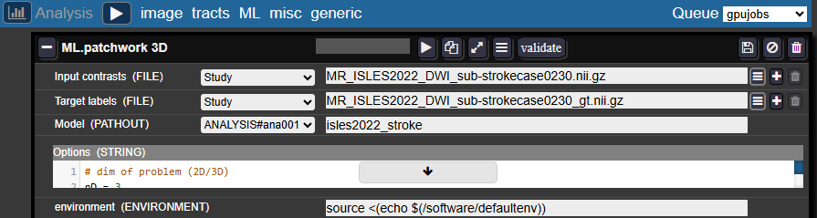
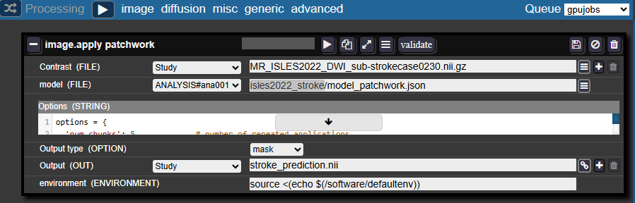

# Segmentation (Deep Learning)

## Training and Using Segmentation Models

The Batchtool allows you to train custom 3D segmentation models on your own data and apply them to new studies.

Here's a short tutorial on how to use the patchwork segmentation model [(Deep Neural Patchworks: Coping with Large Segmentation Tasks, Reisert et. al, 2022)](https://arxiv.org/abs/2206.03210)

### 1. Training a Segmentation Model on Your Data

**In the Batchtool:**

- Create a new **Analysis → ML → Patchwork 3D**

**Entry fields:**

- **Inputs contrasts and Target labels:** Enter the filenames of your images and masks as they appear in each study
- **Model:** Select an analysis folder (create one in your project if needed) and provide a name for your model folder, for example: `isles2022_stroke`

**Configuration:**

- In the **Studies panel**, check the studies you want to train the model on
- Select a job queue and run the analysis
- The job should appear in the Gridstats. You can monitor training progress in the log.

**Training notes:**

- The default number of iterations is 2500
- The model is saved after each epoch, so you can also terminate the job early if performance is satisfactory

### 2. Applying the Trained Model to New Studies

**In the Batchtool:**

- Create a new **Processing → Image → Apply Patchwork**

**Entry fields:**

- **Contrast:** The filename of your image in your studies
- **Model:** Select the same analysis folder and specify: `<model_folder_name>/model_patchwork.json`
    - For example: `isles2022_stroke/model_patchwork.json`
- **Output type:** Select **Mask**
- **Output:** Specify the desired name for the resulting mask

**Configuration:**

- In the **Studies panel**, check the studies you want to apply the model to
- Select a job queue and run the processing
- Monitor the job progress through the logs in Gridstats

## Detailed documentation :

<iframe allowfullscreen="allowfullscreen" frameborder="0" height="569" src="https://docs.google.com/presentation/d/e/2PACX-1vQOg_vdtsXbmM416YA7omZhqhn0DMJ7-anhKpqCi14F3qUMl4GxS1liGx4rJgVM34zSQwBbxNnKlVyN/pubembed?start=false&loop=false&delayms=3000" width="960"></iframe>
