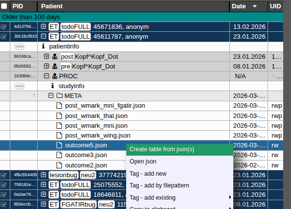
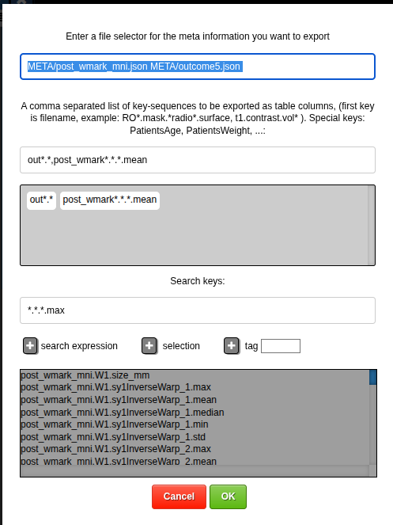
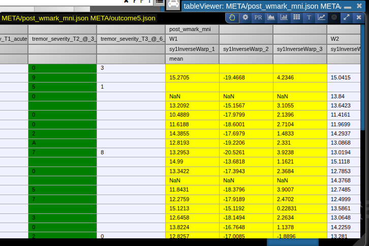
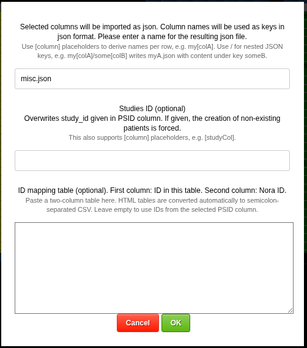

# Table Viewer

The table viewer opens CSV-style tables inside NORA and provides quick frontend tools for creating, editing, filtering, plotting, exporting, and importing tabular metadata.

Typical use cases are:

- create one table from one or more subject JSON files
- inspect metadata exported from NORA
- join two open tables by an ID column
- import selected table columns back as subject-specific JSON files
- run quick exploratory analyses without leaving the browser

## Create a table from JSON files

In the project browser, select one or more JSON files and open the context menu. Choose `Create table from json(s)`.



NORA then asks which JSON files and which keys should be exported into the table.



Use the first field for the file selector. You can select multiple JSON sources, for example two files below `META/`.

Use the key selector field for the JSON keys that should become table columns. The selector accepts comma-separated key expressions. Wildcards are useful when the same measurement exists below several nested keys, for example:

```text
out*.*,post_wmark*.*.mean
```

The search field helps discover available keys. After searching, add matching keys to the selection and confirm with `OK`. NORA creates a table file and opens it in the table viewer.



The first visible column is normally the subject or patient identifier. The following columns are the selected metadata keys. Multi-level JSON keys are shown as multi-line table headers, so grouped measurements remain readable.

## Import table columns as JSON files

The table viewer can also write table values back into subject-specific JSON metadata files. This is useful when you have a table from another source and want to attach the values to NORA subjects.

First mark the ID column and the data columns:

- `Ctrl` + click a column header to mark the ID column. It is shown as the primary selection.
- Click one or more value columns to mark the fields that should be imported.

Open the table viewer menu and choose `import table as subject specific jsons`.



In the dialog:

- enter the JSON filename, for example `misc.json`
- optionally enter a study ID if the table does not already identify the target study
- optionally paste an ID mapping table with two columns: the ID in this table and the corresponding NORA ID

The selected column names are used as JSON keys. You can use `[column]` placeholders in the JSON filename or study ID to derive names from row values. Use `/` in the target name for nested JSON keys.

For example, a filename like:

```text
my[colA]/some[colB]
```

creates row-dependent JSON output and writes the selected value below the nested key.

## Open, paste, download, join, and refetch tables

Tables can come from JSON metadata export, uploaded CSV files, pasted spreadsheet content, or joined tables.

The table viewer detects common delimiters such as semicolon, comma, and tab. When pasting a table, HTML tables from spreadsheet applications are converted to semicolon-separated CSV.

The table viewer menu provides:

- `download table` to export the opened table content
- `join table with ...` to join two open tables
- `save criterias to analysis folder` to save the current table query and viewer state
- `open table in jupyter` to save the table and open a prepared Jupyter notebook
- `refetch table` to rerun the stored metadata query
- `refetch table (with dialog)` to reopen the JSON/key selection dialog before refetching

For joining tables, mark the ID column in both tables with the primary column selection and mark the columns that should be kept from each table. The joined result opens as a new generated table.

## Select columns and rows

Column selection drives all analysis tools.

The table viewer uses three column roles:

- independent variables: normal selected columns
- dependent variable or target: primary selected column
- covariates: secondary/covariate columns

In practice:

- click a header to select a normal analysis column
- `Ctrl` + click a header to promote it to the target or ID role
- `Shift` + click a header to mark it as a covariate
- click again to remove a selection

Use the header context menu for larger operations:

- select all columns
- select only columns with enough valid numeric data
- select marked columns from a dragged text/header range
- deselect all columns
- copy selected columns
- add, rename, or delete a column
- deselect rows by a column expression
- remove all row deselections
- toggle a column as combinatorial

Rows can be excluded from analysis. `Ctrl` + click a row to toggle exclusion. `Ctrl` + `Shift` + click extends the exclusion state over a range. Excluded rows are ignored by the analysis plots.

The row context menu can copy either the deselected subject IDs or the remaining subject IDs to the clipboard.

## Add derived columns

Use `add column` from the header context menu to calculate a new column from selected columns.

In the expression dialog:

- use `n(idx)` for the numeric value of selected column `idx`
- use `s(idx)` for the string value of selected column `idx`
- use `Delta(idx, 'A', 'B', ...)` to create binary indicator columns from categories
- use `Stair(idx, 'A', 'B', ...)` to encode categories as ordered numeric levels
- add `// name` after an expression, or fill the optional name field, to set the new column name

Examples:

```text
n(0)+n(1)
s(0)=='male'
Delta(0,'control','patient') // group
```

Derived columns are stored with the table viewer state when the table criteria are saved.

## Mark combinatorial columns

A combinatorial column is treated as a grouping variable instead of a continuous numeric variable. Use `toggle combinatorial` from the header context menu.

Combinatorial columns are useful for:

- coloring scatter plots by group
- splitting distribution plots by category
- converting categories into indicator variables in correlation matrices
- defining the class column for PR/ROC analysis

The table viewer automatically treats columns with a small number of distinct values as group-like in several analyses, but explicit combinatorial marking is safer when the meaning is categorical.

## Scatter plots and linear models

Select at least two numeric columns and click the scatter/linear-model tool.

The target column is the dependent variable. Other selected numeric columns are modeled as independent variables. Covariate columns are included in the model but are visually treated as adjustment variables.

The scatter plot shows:

- data points
- the fitted model line
- target statistics, including standard deviation, model error, explained variance, sample count, and number of invalid values
- per-variable statistics such as beta, slope, p-value, and t-value

Available options:

- `rank transform` converts numeric values to ranks before fitting
- `switch x/y` swaps the selected x and y interpretation
- `prediction plot` plots predicted values against observed target values

Clicking a point opens actions to deactivate the subject, select it in the table, start an autoloader, or copy the subject ID.

The statistics panel also provides `allvsall`, which opens an all-against-all model summary with p-values, beta values, t-values, and correlations.

## Histograms

Select one or more numeric columns and click the histogram tool.

The histogram view supports:

- configurable number of bins
- normalized percentages or raw counts
- summary statistics for each selected variable
- a t-test summary when two datasets are compared

Use separate selected numeric columns when you want to compare multiple histograms in one view.

## Correlation matrix

Select several columns and click the matrix tool.

The matrix computes pairwise linear models between selected independent variables and target variables. Covariate columns are included as adjustment variables. If no explicit target is selected, the selected variables are compared against each other.

The matrix view can show:

- p-values
- t-values
- slope
- intercept
- Pearson correlation
- explained variance

The p-value view reports multiple-comparison thresholds:

- Benjamini/Hochberg FDR 5%
- Benjamini/Yekutieli FDR 5%
- Bonferroni 5%

Cells are color-coded by effect direction and strength. Click a matrix cell to open the corresponding scatter/linear-model plot. Use the export buttons to create PDF or CSV output.

## Bar plots and grouped statistics

Click the `T` tool to create grouped statistics and bar-style plots.

This view is useful when selected numeric variables should be compared across groups. It can show:

- scatter points
- violin-style distributions
- error bars
- grouped summary statistics
- pairwise t-tests

Available options:

- `scatters` toggles individual points
- `violin` toggles distribution outlines
- `errorbars` toggles percentile-based error bars
- `sort alternative` changes the ordering of plotted variables

When covariates are selected, numeric variables are corrected for those covariates before plotting.

## Precision/recall and ROC curves

Select a numeric score column and a combinatorial class column, then click `PR`.

The PR/ROC view can show:

- precision/recall curves
- ROC curves
- AUC
- accuracy at 50%
- best accuracy and threshold
- class balance
- optional bootstrap confidence intervals

Available options:

- `ROC` switches from precision/recall to ROC mode
- `bootstrap` sets the number of bootstrap repetitions; use `-1` to disable bootstrapping

## Time series plots

Select several columns that represent ordered measurements and click the line-chart tool.

The table viewer sorts the selected column names numerically where possible and plots one line per row. If one selected column is marked as the target/color column, its values are used to choose line colors.

This is useful for repeated measures, temporal columns, or ordered feature series where each subject should be drawn as one curve.

## Export plots

Chart panels include an `export as svg` button. Use it to save plots from scatter plots, histograms, PR/ROC curves, bar plots, and time series views.

For correlation matrices, use `to PDF` or `to CSV` in the matrix panel.
