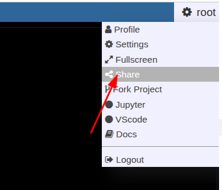
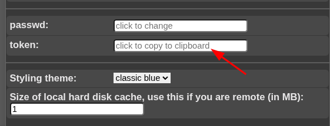

# URL Calls and Sharedlinks

#### Shared links (hanging protocols)

Suppose you have arranged a case in the viewer and want to send it to partner, you can save the state and generate a link to access the state via



If you have called a link, you can modify and use again the "share" button to overwrite the old link (or create a new one).

#### URL calls

Suppose you have a NORA project with configured autoloader and want to call a specific case from an external application. You can call NORA via

```
https://nora.ukl.uni-freiburg.de/godzilla/index.php?asuser=root&project=WHATEVER&call={"pid":"yourpatientid","sid":"your studyid","selmode":"yourmode","preset":"youpresetname","user":"username","token":"yourtoken"}
```

The only mandatory options are "user" and "token" for authentication (if you are not already authenticated). Get the token from your profile. Note that you need to create your own password (LDAP authentication is not possible).


