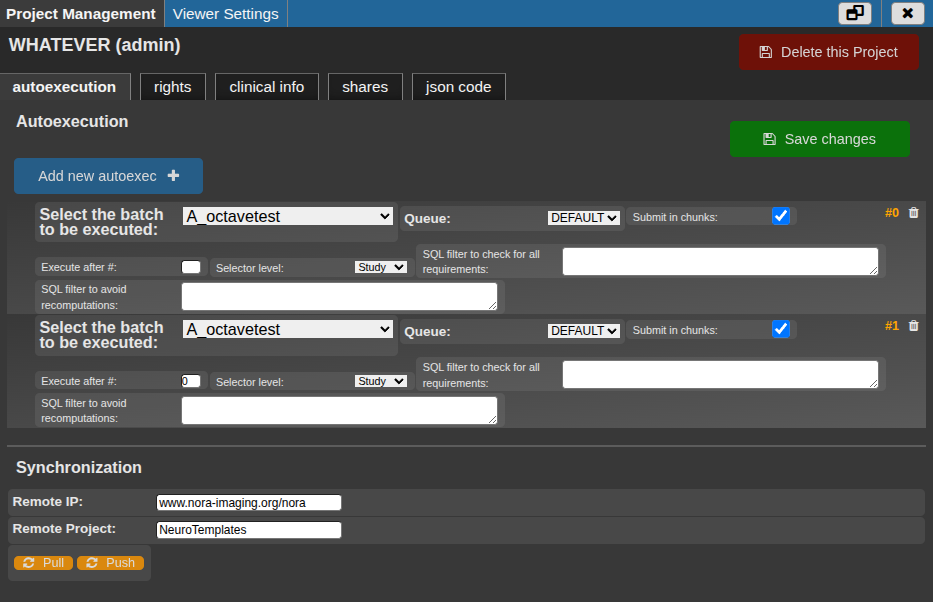
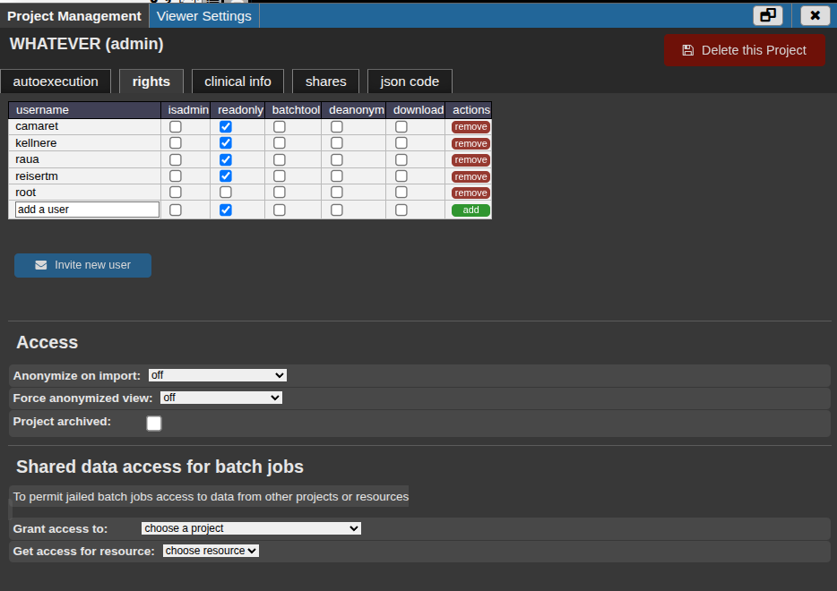
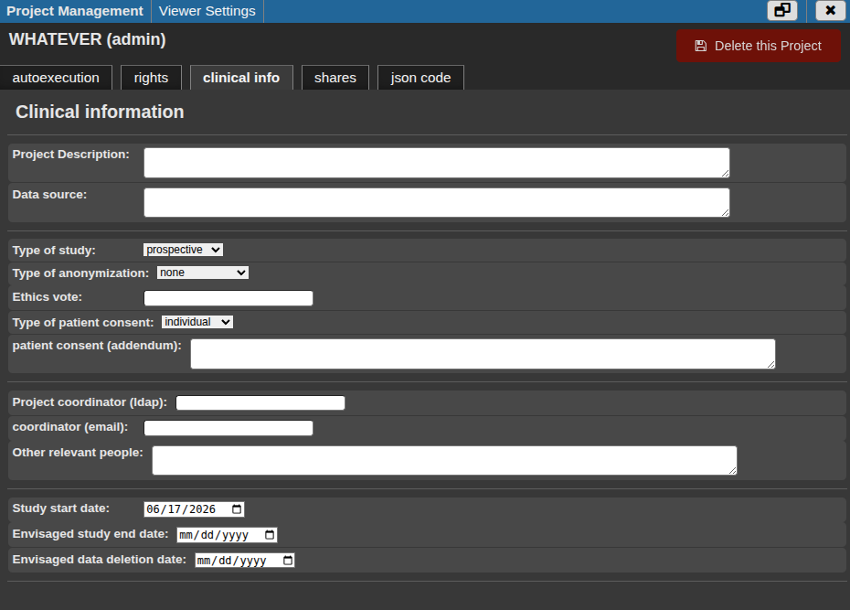
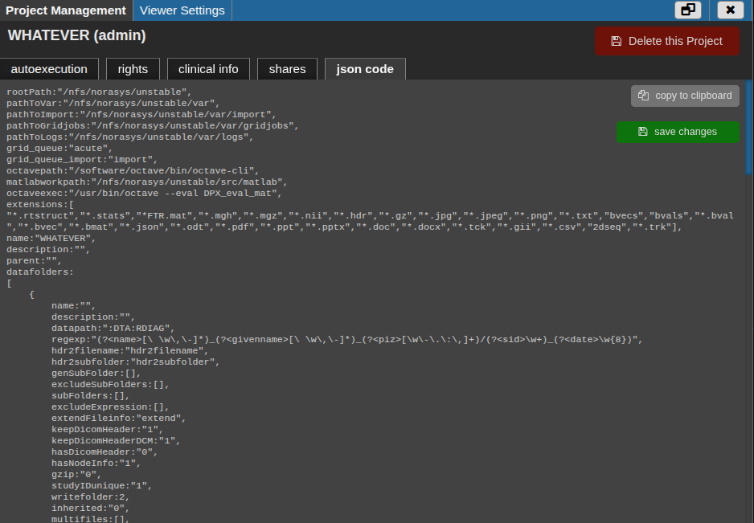
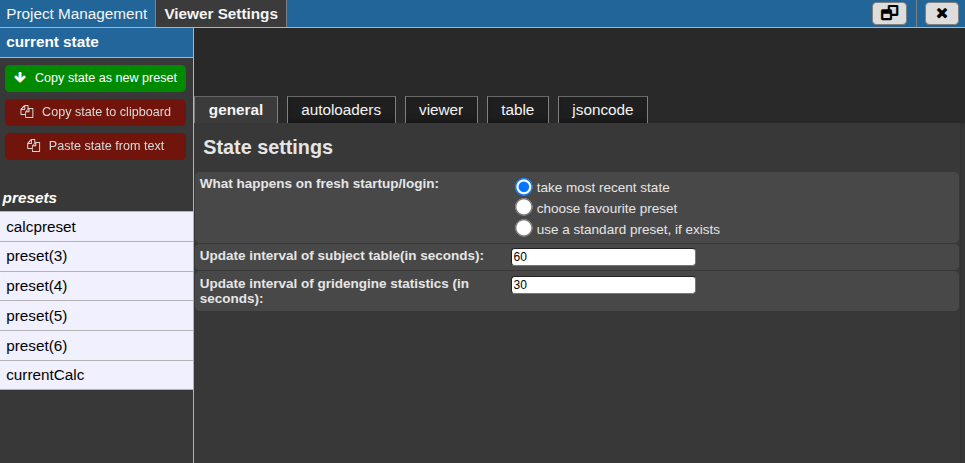
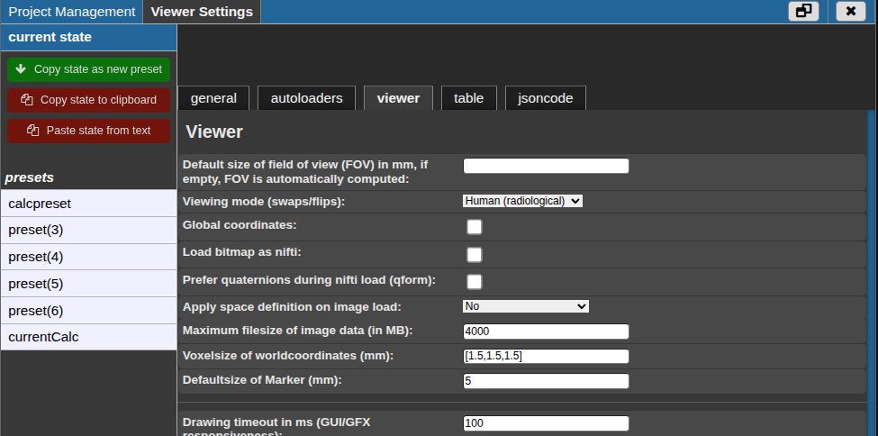
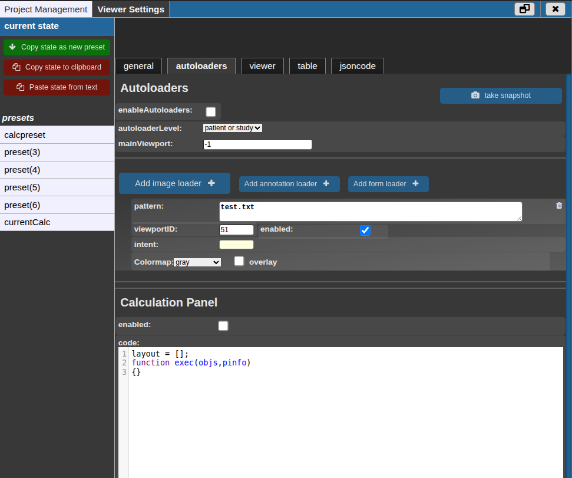
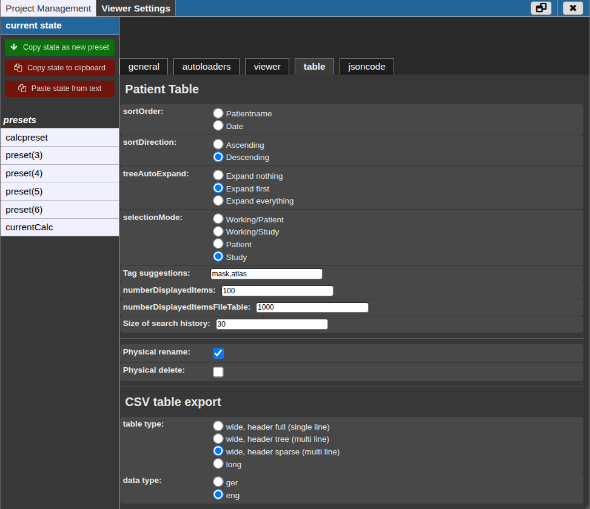

# Settings

The settings dialog contains two areas: project-level settings and viewer settings. Project-level settings are mainly for project administrators. Viewer settings affect how NORA opens, displays, filters, and reloads data for the current user or for saved presets.

Open the dialog from the settings button in the NORA toolbar. The available tabs depend on your rights in the active project. If you are not a project admin, the project-management area may be hidden or read-only.

## Project Management

Project Management controls administrative settings for the active project. Use it when you need to manage project access, document project metadata, configure automated processing after import, review shared links, or inspect advanced project metadata.

### Autoexecution

Autoexecution starts a saved batch automatically for new or selected project data. This is useful for standardized post-import processing, quality-control steps, or project-specific analysis pipelines.

Each autoexecution entry selects a saved batch and defines how it should be submitted:

- **Select the batch to be executed** chooses the saved batch definition.
- **Queue** selects where the job should run.
- **Submit in chunks** submits separate jobs instead of one combined run. This is usually better for large projects because jobs can be scheduled independently.
- **Execute after #** can be used to order dependent autoexecution steps.
- **Selector level** decides whether the batch is evaluated per study or per patient.
- **SQL filter to check for all requirements** limits execution to data that matches the project rule.
- **SQL filter to avoid recomputations** skips data that has already been processed.

The synchronization fields at the bottom are for copying project state between NORA instances. Use **Pull** to fetch settings from a remote project and **Push** to send the current project settings to the remote project.

### Rights And Access

The rights table defines what each user may do in the project.

- **isadmin** gives the user project-administration rights.
- **readonly** prevents normal editing actions while still allowing access to the project.
- **batchtool** allows the user to run processing workflows from the project.
- **deanonym** allows the user to see identifying information when the project otherwise uses anonymized views.
- **download** allows data download from the user interface.
- **remove** withdraws the user's project rights.

Use the last row to add a new user. Enter the username, choose the rights, and press **add**. **Invite new user** can be used when the person is not yet registered on the system.

The **Access** section below the table controls data-protection behavior for the project:

- **Anonymize on import** determines whether imported data should be anonymized automatically.
- **Force anonymized view** controls whether users are forced to see anonymized names or anonymized names plus hashed identifiers.
- **Project archived** marks the project as archived.
- **Shared data access for batch jobs** allows jobs from another project, or selected shared resources, to access this project's data. This is relevant for jailed processing jobs that otherwise only see their own project data.

### Clinical Information

The clinical information tab documents the administrative and ethical context of a project. It does not load image data by itself, but it helps project admins keep the project understandable and auditable.

Important fields include:

- project description and data source
- type of study
- anonymization type
- ethics vote
- patient consent status and addendum
- project coordinator, email contact, and other relevant people
- study start, planned end, and planned data deletion dates

Keep this information current for projects that are shared across teams or used over a longer period.

### Shares

The shares tab lists shared links that have been created for the project. Each row shows the owner, date, comment, and link identifier. Click the link entry to copy the full shared link. Use **remove** to invalidate a share that should no longer be accessible.

### JSON Code

The JSON code tab exposes the full project metadata in an editable form. This is an advanced administration view. Prefer the dedicated tabs for normal changes, because they validate common fields and are easier to review. Use the JSON view only when a setting is not available through the normal forms or when you need to inspect the complete project configuration.

## Viewer Settings

Viewer Settings controls the current state and saved presets. A state is the currently active setup: visible panels, viewer layout, table behavior, autoloaders, and related defaults. A preset is a reusable setup that can be applied later or shared according to its preset rights.

The left side lists **current state** and the available presets. The buttons above the list let you:

- copy the current state as a new preset
- copy the state to the clipboard
- paste a state from text

For saved presets, **Apply preset as state** activates the selected preset, **set preset as startup default** makes it the preferred startup preset, and **delete preset** removes it if you have write rights.

### State Settings

State settings determine what NORA restores when you log in or open the project again.

- **take most recent state** restores the last saved working state.
- **choose favourite preset** starts from the preset marked as startup default.
- **use a standard preset, if exists** uses the project standard preset when one is available.
- **Update interval of subject table** controls how often the subject/study table refreshes.
- **Update interval of gridengine statistics** controls how often job status information refreshes.

Use the most recent state for interactive daily work. Use a favourite or standard preset when a project should always open in a consistent layout.

### Viewer

The viewer tab controls image orientation, rendering, layout, overlays, and form behavior.

The first group affects image loading and spatial interpretation:

- **Default size of field of view** fixes the initial visible field of view. Leave it empty for automatic sizing.
- **Viewing mode** selects the anatomical orientation convention, such as radiological, neurological, mouse, or memory-aligned viewing.
- **Global coordinates** uses project/world coordinates instead of only local image coordinates.
- **Load bitmap as nifti** treats bitmap images as image volumes.
- **Prefer qform** prefers quaternion-based NIfTI orientation when loading NIfTI data.
- **Apply space definition on image load** applies a selected anatomical space definition if the image needs one.
- **Maximum filesize of image data** limits what the viewer will load.
- **Voxelsize of worldcoordinates** and **Defaultsize of Marker** define defaults for spatial tools and marker display.

The drawing and appearance fields trade visual quality against responsiveness:

- **Drawing timeout** keeps the interface responsive during rendering.
- **Drawing quality 2D** controls normal 2D rendering quality.
- **Drawing quality 2D during ROIpaint** can be lower to keep drawing responsive.
- **Background Color**, **Image border**, **Drawing quality 3D**, **Background Color in 3D**, **Linewidth 3D**, **Transparency on Fibers**, and **Pose pictogram** control the visual appearance of 2D and 3D views.

The viewport layout fields define the default screen arrangement:

- table width
- number of visible viewport columns and rows
- bar viewports and their size
- a large left viewport and its size
- whether overlay and ROI toolbars stay visible

The remaining defaults control overlays and forms:

- histogram visibility and size
- crosshair visibility
- infobar visibility
- ROI transparency
- ROI, atlas, and overlay outlines
- form autosave and user-specific form naming

### Autoloaders

Autoloaders define which files NORA should automatically open when you select a patient or study. They are useful for project workflows where users should always see the same image, overlay, annotation, or form without manually searching for it.

- **enableAutoloaders** switches autoloading on for the preset or state.
- **autoloaderLevel** decides whether loading follows patient selection, study selection, or either level.
- **mainViewport** defines the main viewport used by the loader setup.
- **Add image loader** creates an image-loading rule.
- **Add annotation loader** creates an annotation-loading rule.
- **Add form loader** creates a form-loading rule.
- **take snapshot** builds autoloader entries from the files currently open in the viewer.

Each loader contains a pattern, a viewport, an enabled checkbox, and an intent. The pattern describes which file should be selected. The viewport decides where it should open. The intent controls special behavior such as overlays, colormaps, ROI creation, annotation handling, or form loading.

The **Calculation Panel** can be enabled for project-specific calculations that run alongside the autoloader setup. Most users only need it when a project workflow explicitly provides calculation code.

### Table

The table tab controls the patient and study table, file table limits, tag suggestions, and CSV export.

Patient-table options include:

- **sortOrder** and **sortDirection** for the default ordering.
- **treeAutoExpand** to decide whether the project tree opens collapsed, with the first study expanded, or fully expanded.
- **selectionMode** to choose whether the main working level is patient or study based.
- **Tag suggestions** for common tags offered during tagging.
- **numberDisplayedItems** and **numberDisplayedItemsFileTable** to limit long lists.
- **Size of search history** to control how many recent searches are remembered.
- **Physical rename** and **Physical delete** to allow or prevent file-system-level rename and delete actions where the user's project rights permit them.

CSV export options define the shape and locale of exported tables:

- **wide, header full** creates a wide table with a single complete header line.
- **wide, header tree** creates a wide table with a multi-line tree-like header.
- **wide, header sparse** creates a wide table with a compact multi-line header.
- **long** exports one measurement or entry per row.
- **ger** and **eng** choose locale-specific formatting for exported values.

### JSON Code

The viewer JSON code tab shows the complete selected state or preset. Use it for copying, checking, or carefully editing settings that are not exposed in the normal tabs. For routine work, use the form tabs because they are easier to read and less error-prone.
