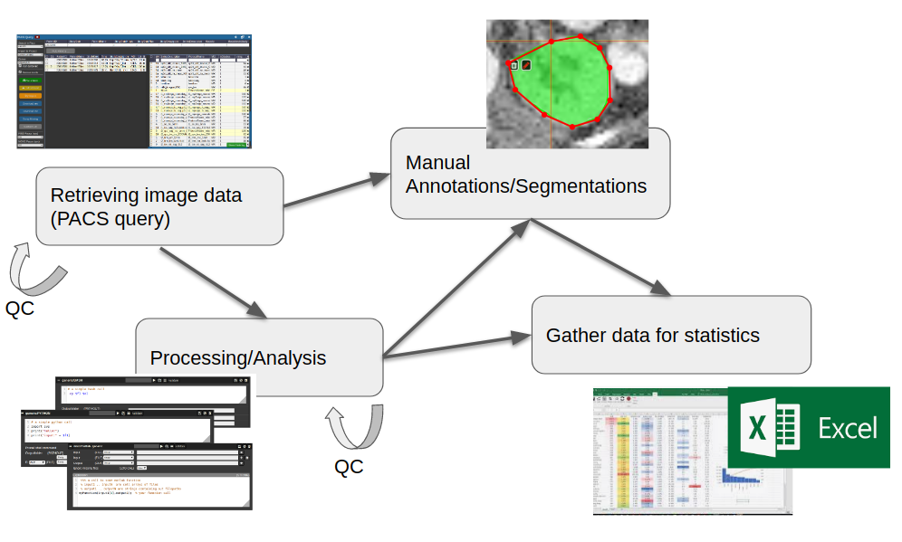
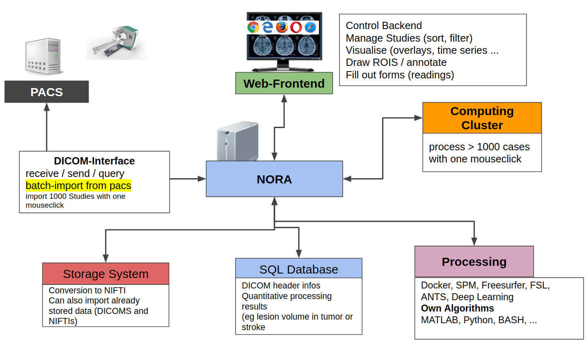

# What is NORA?

Nora is a general purpose medical imaging platform, which tries to fuse all aspects involved in modern clinical and fundamental imaging research.   
It covers the following aspects

- **Viewing:**    
    a fully featured medical imaging viewer (like 3D slicer, ITK snap, etc.) and support of format slike DICOM, NIFTI, NRRD, MGH, GIFTI, TCK, ....
- **Annotations and Readings:** allow for high-throughput geometric and textual labeling/annotation of large datasets
- **Subject management and image archive**   
    similar to frameworks like XNAT, but based on research format NIFTI. Additional non-imaging information is held as JSONs.
- **Image Processing:** include your favourite MATLAB tools, PYTHON tools, tensorflow, etc .. and apply on groups of subjects/study on a high perf. computing cluster.
- **Integration into clinical routine and research:** DICOM send/retrieve to allow easy pull (batch-import) and push to clinical systems. Automatic routing of image processing/analysis pipelines

All these aspects are integrated into a multi-user web-frontend to organize collaborative research. A typical workflow starts with an image data query from your local PACS system. NORA provides to import imaging studies of large cohorts with a few clicks. The so called "autoloader" allows to easily browse the imported data in effective manner for quallity control (QC). The imported data can be preprocessed and analyzed by your favourite image processing tools (MATLAB, Python, BASH) and machine learning scripts. Annotation and labeling tools allow for an easy setup of segmentation/detection tasks with modern AI algorithms.

From the technical perspective NORA has a simple client/server architecture. Data is held on a central server/cloud storage and users have access to the system via a web-frontend. NORA's backend consists of a weberver (apache2, php7, nodejs), a computing cluster (Slurm or SGE/torque), DICOM nodes, and an SQL database (mysql). The SQL database holds

- Locations of imaging data items (basically NIFTI files, but also NRRD, MGH, GIFTI, TCK, TRK, STL, ...).
- Project information (collections of subjects/studies)
- User and access/rights information (synchronize with your LDAP/AD)
- Processing pipelines/scripts 
    
